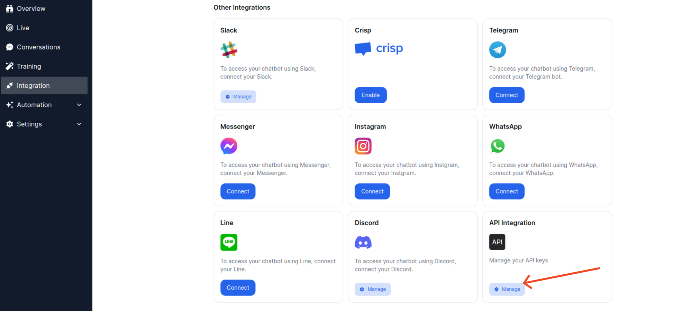
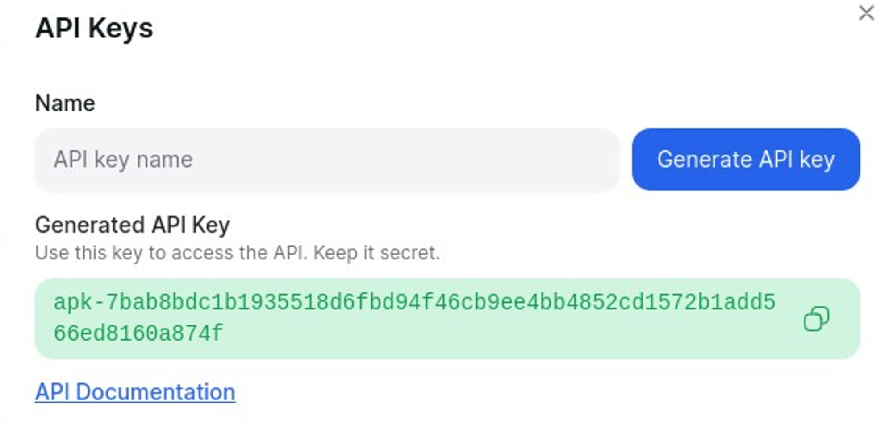

# API Integration

> Learn how to integrate your chatbot using the YourGPT Chatbot API

<Callout title="Connect Your Chatbot Anywhere with Chatbot API" type="tip" />

Welcome to the Documentation page for **YourGPT Chatbot APIs**

## Generating Keys

- Go to your **Integration** and click on **manage API integration**

<div className="flex justify-center items-center rounded-md p-4">
  
</div>

- Now create one key.

- Copy your **Generated API key**

<div className="flex justify-center items-center rounded-md p-4 md:pl-20">
  
</div>

<Callout title="Note" type="note">
The widget_uid is your chatbot's Widget ID.

**For Example**: `84292q0qw1eqw124-4173-af6e-569477ac9013`
</Callout>

<div className="mt-12">
  <div className="grid grid-cols-1 md:grid-cols-2 gap-6">
    <a href="/chatbot/api-reference/chatbot/createSession" className="block p-6 bg-white dark:bg-gray-800 rounded-lg border border-gray-200 dark:border-gray-700 hover:shadow-lg transition-shadow no-underline">
      <div className="text-xl font-semibold mb-2 text-gray-900 dark:text-white">How to Create Session</div>
      <p className="text-gray-600 dark:text-gray-400 m-0">Guide to Creating Sessions</p>
    </a>
    <a href="/chatbot/api-reference/chatbot/sendMessage" className="block p-6 bg-white dark:bg-gray-800 rounded-lg border border-gray-200 dark:border-gray-700 hover:shadow-lg transition-shadow no-underline">
      <div className="text-xl font-semibold mb-2 text-gray-900 dark:text-white">Send a Message via API</div>
      <p className="text-gray-600 dark:text-gray-400 m-0">API to send messages seamlessly</p>
    </a>
  </div>
</div>

The Integration ID for the API is **17**.

## API Usage

- **success code : 200, type: RXSUCCESS**
- **error code 400, type RXERROR**

### Create Session API

```bash
curl --location 'https://api.yourgpt.ai/chatbot/v1/createSession' \
--header 'Content-Type: application/x-www-form-urlencoded' \
--header 'api-key: pks-3e0a221e3dqweqwef0ecd123qe33a728e1dfa2a0ee01cc4ff8b8c99c21a45cff9' \
--data-urlencode 'widget_uid=84292q0qw1eqw124-4173-af6e-569477ac9013'
```

**Response**

```js
{
    "type": "RXSUCCESS",
    "message": "Chatbot session created successfully",
    "data": {
        "id": 1910677,
        "session_uid": 17226012685401506,
        "chat_mode": "1",
        "project_id": 197,
        "integration_id": 17,
        "state": "pending",
        "segment": "chat",
        "status": "open",
        "device_type": null,
        "platform": null,
        "ip": null,
        "country": "IN",
        "visitor_id": null,
        "is_emulator": false,
        "data": {},
        "contact_id": null,
        "updatedAt": "2024-08-02T12:21:08.540Z",
        "createdAt": "2024-08-02T12:21:08.540Z"
    }
}
```

<Callout title="Note" type="note">
To use the send message API, you must first establish a session. Obtain a session UID by executing the Create Session API.
</Callout>

### Send Message API

```bash
curl --location 'https://api.yourgpt.ai/chatbot/v1/sendMessage' --header 'Content-Type: application/x-www-form-urlencoded' --header 'api-key: pks-3e0a221e3dqweqwef0ecd123qe33a728e1dfa2a0ee01cc4ff8b8c99c21a45cff9' --data-urlencode 'widget_uid=84292q0qw1eqw124-4173-af6e-569477ac9013' --data-urlencode 'session_uid=3977b1x2d-d1e1-0d5a-a473-a6841bc4c880' --data-urlencode 'message=hey there?'
```

**Response**

```js
{
    "type": "RXSUCCESS",
    "message": "AI reply",
    "data": {
        "send_by": "assistant",
        "origin": "api",
        "session_uid": "39772b8d-d1c8-4d5a-a473-a6841bc4c880",
        "type": "text",
        "message_id": 241043,
        "message": "Hello! How can I assist you today?",
        "content_type": "picker",
        "id": 241043,
        "choices": [
            {
                "icon": "👍",
                "text": "I am satisfied",
                "value": "like",
                "enabled": true
            },
            {
                "icon": "👎",
                "text": "I am not satisfied",
                "value": "dislike",
                "enabled": true
            },
            {
                "icon": "🦸",
                "text": "Request a human operator",
                "value": "requesthumanoperator",
                "enabled": true
            }
        ]
    }
}
```