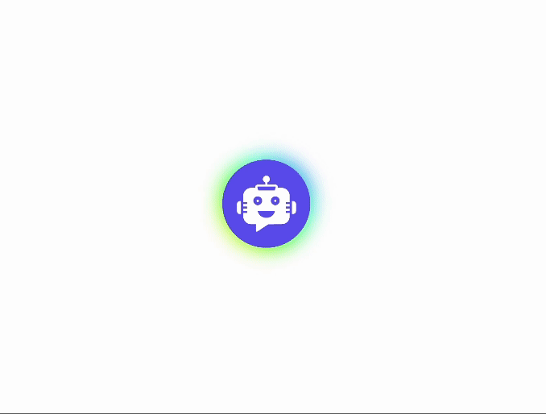
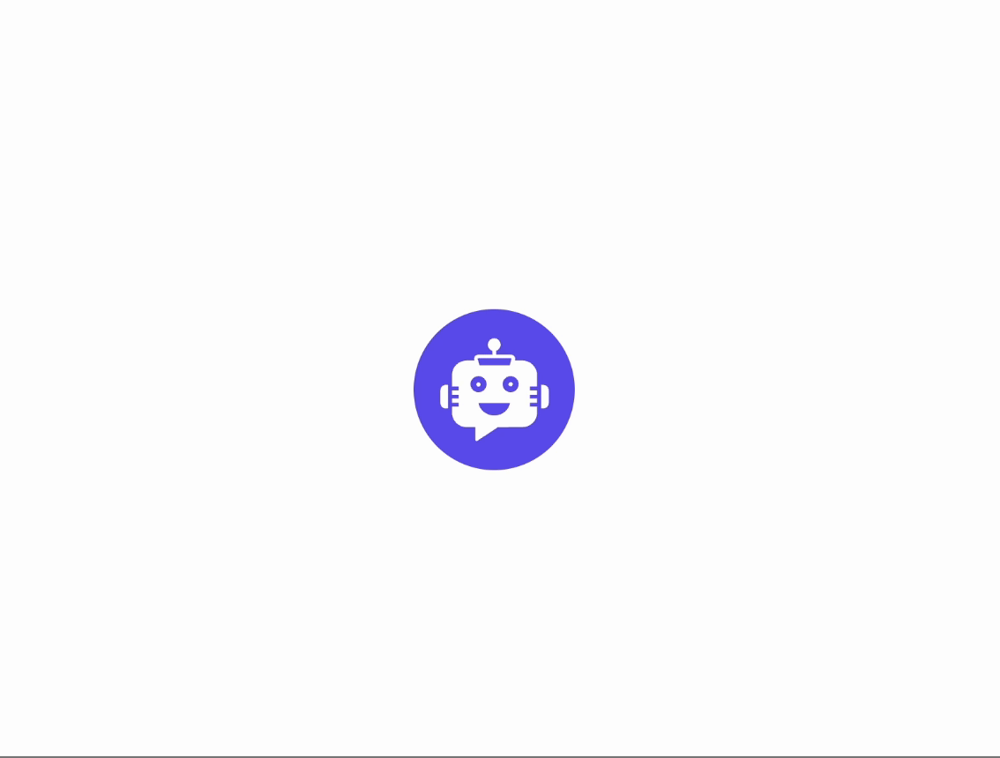

# Styling

> Customize the chatbot widget using CSS variables and button animations

You can customize the appearance of your chatbot by modifying the following CSS variables:

<Callout type="info" title="Note">
Use <code>.ygpt-chatbot</code> class to override the default styling of the chatbot. You can increase the specificity of the selector by adding more classes to it. For example, <code>.ygpt-chatbot.ygpt-chatbot</code> will override the default styling of the chatbot.
</Callout>

---

## Usage

```css title="example.css" file="CSS"
.ygpt-chatbot.ygpt-chatbot {
     
 /* FONT STYLE */
  --yourgptChatbotFontFamily: 'Roboto', sans-serif;

/*_ PRIMARY COLOR _*/
--yourgptChatbotPrimaryColor: #000;

/*_ FOR SAHDES PLEASE ADD HSL VALUES IN FORMAT OF - H S% L% _*/
--yourgptChatbotPrimaryColorHsl: 0 0% 0%;
--yourgptChatbotSurfaceColorHsl: 0 0% 0%;
--yourgptChatbotTextColorHsl:0 0% 0%;

/*_ USER MESSAGE STYLING _*/
--yourgptChatbotUserMessageBgColor: #f5f5f5;
--yourgptChatbotUserMessageTextColor: #000;

/*_ BOT MESSAGE STYLING _*/
--yourgptChatbotBotMessageBgColor: #f5f5f5;
--yourgptChatbotBotMessageTextColor: #000;
}
```

#### CSS Variables

| Variable                               | Description                                |
| -------------------------------------- | ------------------------------------------ |
| `--yourgptChatbotFontFamily`           | Font family of the chatbot                 |
| `--yourgptChatbotPrimaryColor`         | Primary color of the chatbot               |
| `--yourgptChatbotPrimaryColorHsl`      | Primary color of the chatbot in HSL format |
| `--yourgptChatbotSurfaceColorHsl`      | Surface color of the chatbot in HSL format |
| `--yourgptChatbotTextColorHsl`         | Text color of the chatbot in HSL format    |
| `--yourgptChatbotUserMessageBgColor`   | Background color of the user message       |
| `--yourgptChatbotUserMessageTextColor` | Text color of the user message             |
| `--yourgptChatbotBotMessageBgColor`    | Background color of the bot message        |
| `--yourgptChatbotBotMessageTextColor`  | Text color of the bot message              |

---

## Animations

You can inject custom animations to the widget button using the following CSS:

### Multi-Gradient

<div className="flex justify-center max-w-[390px] md:max-w-[300px]">
  
</div>

```css title="example.css" file="CSS"
/* Styling for the outer widget button */
.ygpts-widgetBtnMiddle::before {
    content: "";
    /* Creating a gradient background */
    background: linear-gradient(45deg, #ff0000, #ff7300, #fffb00, #48ff00, #00ffd5, #002bff, #7a00ff, #ff00c8, #ff0000);
    position: absolute;
    top: -2px;
    left: -2px;
    background-size: 400%;
    z-index: -1;
    /* Applying a blur effect */
    filter: blur(5px);
    width: calc(100% + 4px);
    height: calc(100% + 4px);
    /* Applying an animation */
    animation: glowing 20s linear infinite;
    transition: opacity 0.3s ease-in-out;
    border-radius: 50px;
    opacity: 1;
}

/*_ Styling for the after pseudo-element of the outer widget button _*/
.ygpts-widgetBtnMiddle::after {
  z-index: -1;
  content: "";
  position: absolute;
  width: 100%;
  height: 100%;
  /*_ Setting the background color _*/
  background: #622bff;
  left: 0;
  top: 0;
  border-radius: 40px;
}

/*_ Defining the glowing animation _*/
@keyframes glowing {
  0% {
    background-position: 0 0;
  }
  50% {
    background-position: 400% 0;
  }
  100% {
    background-position: 0 0;
  }
}
```

### Glowing

<div className="flex justify-center max-w-[390px] md:max-w-[300px]">
  
</div>

```css title="example.css" file="CSS"
.ygpts-widgetBtnMiddle {
  position: relative;
  transition: all 0.3s ease-out;
  pointer-events: none;
  z-index: 1;
}

.ygpts-widgetBtnMiddle::after {
  box-sizing: border-box;
  z-index: -1;
  content: "";
  position: absolute;
  display: block;
  width: 30px;
  height: 30px;
  top: 10px;
  left: 10px;
  border: 1.5px solid #622bff;
  border-radius: 50%;
  animation: pulsate 1.5s ease-out infinite;
}

@keyframes pulsate {
  0% {
    transform: scale(1);
  }
  100% {
    transform: scale(2.5);
    opacity: 0;
  }
}
```

### Ripple

<div className="flex justify-center max-w-[390px] md:max-w-[300px]">
  
</div>

```css title="example.css" file="CSS"
.ygpts-widgetBtnMiddle::before {
  position: absolute;
  content: "";
  background-color: #622bff;
  height: 100%;
  width: 100%;
  border: 1px solid #622bff;
  border-radius: 50px;
  animation: animGlow 2s ease infinite;
}

@keyframes animGlow {
  0% {
    box-shadow: 0 0 #622bff 1;
  }
  50% {
    box-shadow: 0 0 8px 6px #642bffc1;
  }
  100% {
    box-shadow: 0 0 #622bff 1;
  }
}
```