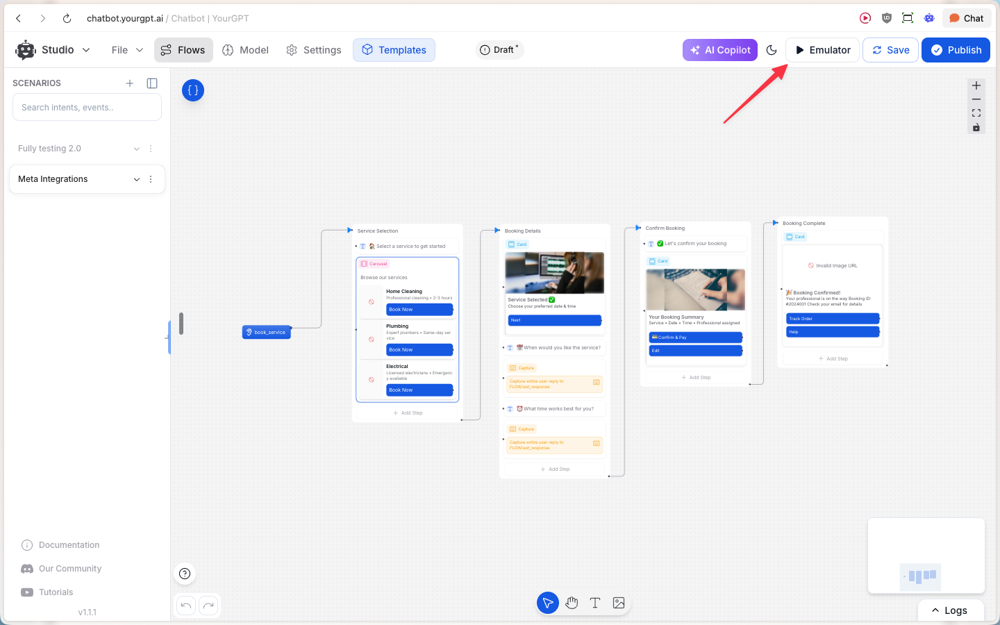
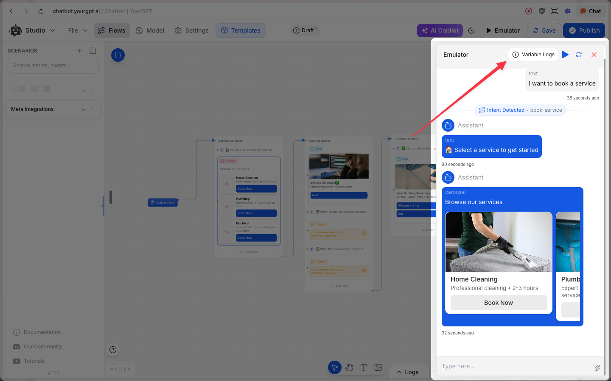
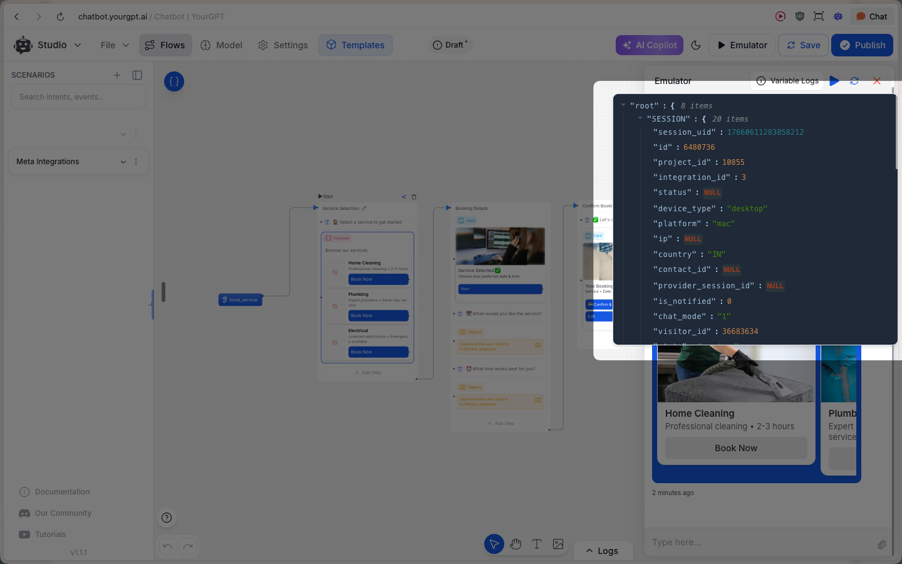
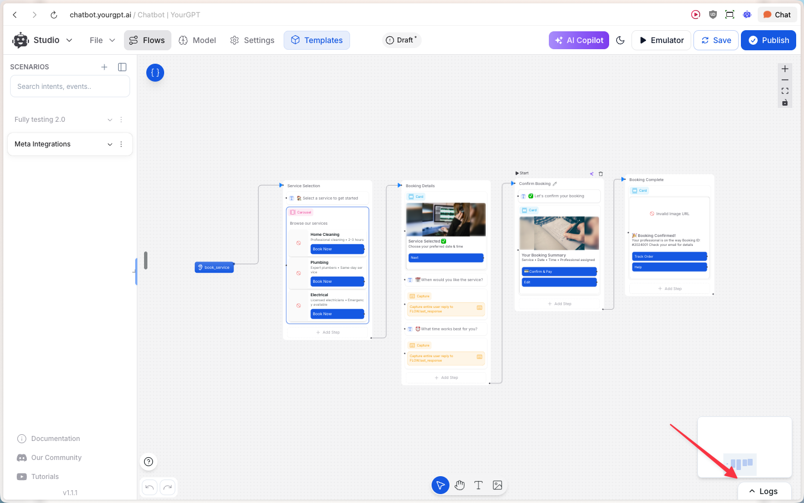
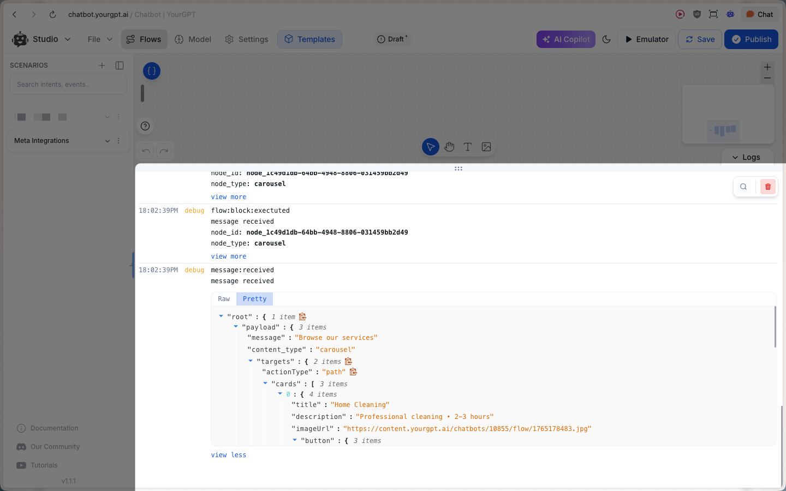

# AI Studio

> Debug your chatbot flows by testing runs, inspecting variables, and reviewing runtime events.

AI Studio is the best place to debug a run by:

- **Inspecting state** in Variable Logs (read-only snapshot of what the runtime “knows”)
- **Tracing execution** in Logs (runtime events + payloads so you can see what fired and why)

## 1. Variable Logs

<Steps>
  <Step>
    Open the emulator from the top-right **Emulator** button.

    
  </Step>
  <Step>
    From inside the emulator, open **Variable Logs** .

    
  </Step>
</Steps>

Variable Logs are for **read-only inspection** during debugging. Use them to confirm the run context, identifiers, and environment signals the runtime is using.

**Common things to look for:**

  <Card title="Project + environment">
    Confirm the project identifier (and environment/workspace if applicable) matches what you’re testing.
  </Card>
  <Card title="Session identifiers">
    Copy session/run identifiers so you can correlate them with Execution Logs and other debugging tools.
  </Card>
  <Card title="Visitor identifiers">
    Verify visitor/user identifiers and related session IDs match the conversation you expect.
  </Card>
  <Card title="Client context">
    Check device/platform and browser/app signals—useful for debugging channel-specific behavior.
  </Card>
  <Card title="Locale/geo">
    Confirm country (and other locale signals, if present) to debug localization and routing.
  </Card>

**What to debug with Variable Logs:**

  <Card title="Variables not set">
    Confirm the variable exists, the value is what you expect, and whether it changes after the step that should set it.
  </Card>
  <Card title="Wrong user/session">
    Verify visitor/session identifiers match the conversation you’re testing.
  </Card>
  <Card title="Environment mismatch">
    Confirm you’re testing against the expected project/environment.
  </Card>

<Callout title="Tips" type="tip">
  - **Session details (FLOW object)**: in the emulator, you can open session details (Info / “i”) to view session metadata and the `FLOW` object (variables + current stored values). This view may not update live—close and reopen to refresh.
  - **Variable structure may differ**: the `FLOW` object you see in logs/session details can be structured differently than how variables are referenced inside Studio—use the Variable Logs as the source of truth for what’s stored in this run.
</Callout>

## 2. Execution Logs

<Steps>
  <Step>
    Open the Logs drawer using the bottom-right **Logs** toggle.

    
  </Step>
</Steps>

Logs show runtime events emitted while your flow runs (for example `message:received` and `flow:block:executed`). Each entry typically includes:

- **Event name**: what happened (e.g. a message was received, a block executed)
- **Node metadata**: `node_id` / `node_type` so you can pinpoint where it occurred
- **Payload**: the event data (what was received/sent, what inputs were used, what outputs were produced)

In addition to message and block execution events, Execution Logs commonly help you spot:

- **Intents and events** detected during the conversation
- **Variable changes** as the flow updates state
- **API calls and responses** (when your flow calls external services)
- **Errors/warnings** that explain why a step failed

Use **Raw/Pretty** to switch between the raw event JSON and a more readable view when inspecting payloads.

**What to debug with Logs:**

  <Card title="Message not sending">
    Do you see `message:received`? Do you see the expected `flow:block:executed` events after it?
  </Card>
  <Card title="Wrong card/content">
    Inspect the event **payload** (Pretty view) to confirm exactly what content was generated/sent.
  </Card>
  <Card title="Branching seems wrong">
    Find the first unexpected block execution and compare its payload/inputs to what you expected.
  </Card>
  <Card title="Cross-reference node IDs">
    Each block/step/node has a unique identifier; the selected node’s ID is often reflected in the browser URL. Match that ID with `node_id` in Execution Logs to pinpoint exactly where an event came from.
  </Card>

## Common debugging workflows

- **Message not sending** → Check Logs for `message:received` and whether the expected nodes executed.
- **Wrong card/content** → Inspect the event payload in **Pretty** view to see what was actually sent.
- **Variables not set** → Check **Variable Logs** and compare values before/after the step where they should change.

## See also

- [How to Debug Flows and View Execution Logs in Chatbot Studio?](https://help.yourgpt.ai/article/how-to-debug-flows-and-view-execution-logs-in-chatbot-studio-34)