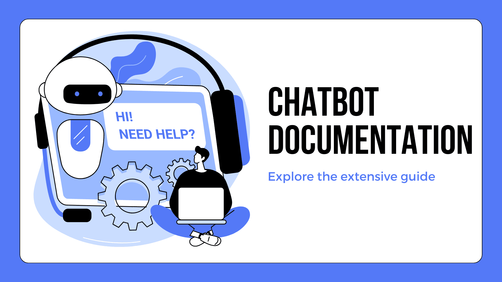

# Introduction

> Build powerful AI agents with our AI-first no-code platform in under two minutes.

YourGPT is an AI-first, no-code platform for building and running AI agents that support real business work. Teams use it to automate customer support, sales workflows, onboarding, and internal operations without relying on engineering-heavy setups.

YourGPT agents do more than respond to queries. They are designed to follow logic, handle decisions, and take action when required, such as triggering workflows, updating systems, or interacting with connected tools.

The platform is fully customizable, supports over 100 languages, and works across industries. Teams can build, launch, and manage AI agents in minutes while staying in control of data, behavior, and outcomes.

## How it works

YourGPT agents are grounded in your business data and workflows.

You train the AI using your own sources, including text, PDFs, Notion, Google Drive, Dropbox, Confluence, YouTube, and more. This ensures responses stay accurate, aligned with your content, and relevant to real business context.

Agents improve through real usage. They learn from interactions, reduce repeated errors, and adapt over time without manual retraining or constant rule updates.

Within the platform, **AI Studio** gives teams control over how agents think, decide, and execute. You can define structured logic sequentially so agents handle workflows in a predictable way.

For actions inside your product, **product-level copilots** allow AI agents to operate directly within your application. Using the Copilot Builder, agents can interact with frontend and backend systems, connect to your SaaS tools, trigger workflows, and update data securely.

Together, these capabilities allow teams to build AI agents that understand context, follow defined logic, and take meaningful action when needed, making them suitable for real business operations.

<Callout type="info">
**No-Code AI Agent Builder** - Effortlessly create AI Agents without coding expertise needed. Build intelligent conversational agents in minutes.

[Create your AI Agent](https://yourgpt.ai/ai-agent)
</Callout>

## Features

<Cards>
  <Card 
    title="No-Code Builder" 
    icon={<LayoutGrid />}
    description="Create your AI Agent effortlessly, no coding required." 
  />
  <Card 
    title="Advanced AI Models" 
    icon={<Cpu />}
    description="Harness advanced AI models that understand and generate human-like responses." 
  />
  <Card 
    title="Multi-Channel Integration" 
    icon={<Share2 />}
    description="Add AI Agent to your websites, social media platforms, mobile apps and messaging services." 
  />
  <Card 
    title="Live Chat Support" 
    icon={<MessageSquare />}
    description="Combine AI-powered support with on-demand human assistance, ensuring customers always receive the help they need." 
  />
  <Card 
    title="AI Studio" 
    icon={<Sparkles />}
    description="AI Agent studio helps you to create Guided Flow based AI agents using intuitive drag-and-drop tools." 
  />
  <Card 
    title="Lead Generation" 
    icon={<UserRoundSearch />}
    description="Capture and nurture leads by integrating lead generation forms seamlessly into the AI Agent experience." 
  />
  <Card 
    title="100+ Languages Support" 
    icon={<Globe />}
    description="Our AI Agent delivers seamless customer support in over 100 languages." 
  />
  <Card 
    title="Functions" 
    icon={<SquareFunction />}
    description="Perform dynamic actions using Functions. Functions are the tools that allows AI Agent to perform various tasks." 
  />
</Cards>

## Get Started

Learn how to get started with YourGPT, a custom Chat GPT builder that answers from your website, documents, FAQs, YouTube videos and more. Unlock the potential of a personalized ChatGPT trained on your data.

<Cards>
 {/* <Card title="About YourGPT Chatbot" href="/chatbot/about" /> */}
  <Card title="Setup Your First AI Agent" href="/chatbot/getting-started/setup" />
  <Card title="Train Your AI Agent" href="/chatbot/getting-started/training" />
</Cards>

## Installation

Learn how to install your custom AI agent on different platforms:

### Website Builders

<Cards>
  <Card title="Add AI to WordPress" href="/chatbot/integrations/website-builders/wordpress" />
  <Card title="Add AI to Shopify" href="/chatbot/integrations/website-builders/shopify" />
  <Card title="Add AI to Webflow" href="/chatbot/integrations/website-builders/webflow" />
  <Card title="Add AI to Wix" href="/chatbot/integrations/website-builders/wix" />
</Cards>

### Chatbot Integrations

<Cards>
  <Card
    title="Add AI to Crisp"
    href="/chatbot/integrations/connectors/crisp"
  />
  <Card
    title="Add AI to Intercom"
    href="/chatbot/integrations/connectors/intercom"
  />
</Cards>

### Social Integrations

<Cards>
  <Card title="WhatsApp" href="/chatbot/integrations/social-platforms/whatsapp" />
  <Card title="Telegram" href="/chatbot/integrations/social-platforms/telegram" />
  <Card title="Instagram" href="/chatbot/integrations/social-platforms/instagram" />
  <Card title="Slack" href="/chatbot/integrations/social-platforms/slack" />
  <Card title="Discord" href="/chatbot/integrations/social-platforms/discord" />
  <Card title="Messenger" href="/chatbot/integrations/social-platforms/messenger" />
</Cards>

### Other Integrations

<Cards>
  <Card
    title="Test your AI Agent"
    href="/chatbot/test-ai-agent"
  />
  <Card
    title="Customize Chatbot Widget"
    href="/chatbot/chatbot-widget/appearance/customization"
  />
  <Card
    title="Add YourGPT to Voice Channels"
    href="/chatbot/integrations/voice/phone"
  />
  <Card
    title="How to Debug Chatbot"
    href="chatbot/debugging/ai-response/incomplete-ai-response"
  />
</Cards>

## Functions

Learn how to enhance your chatbot's capabilities by integrating it with functions: System Functions, API Functions and more.

<Cards>
  <Card title="Functions" href="/chatbot/ai-agent-management/functions" />
</Cards>

## Customization

Explore methods to customize your custom ChatGPT chatbot's appearance, behavior, and domain post-installation:

<Cards>
  <Card title="Custom chatbot appearance" href="/chatbot/chatbot-widget/appearance/customization" />
  <Card title="Custom chat widget theme" href="/chatbot/chatbot-widget/appearance/pre-built-themes" />
  <Card title="Custom domain" href="/chatbot/chatbot-widget/appearance/custom-domain" />
  <Card title="Agent persona" href="/chatbot/ai-agent-management/agent-persona" />
</Cards>

## Studio

Studio provides advanced tools like intents, events, entities, and variables to create dynamic chatbot experiences.

<Cards>
  <Card title="Intents" href="/chatbot/studio/elements/intents" />
  <Card title="Events" href="/chatbot/studio/elements/events" />
  <Card title="Entities" href="/chatbot/studio/elements/entities" />
  <Card title="Messages" href="/chatbot/studio/elements/messages" />
  <Card title="Variables" href="/chatbot/studio/elements/variables" />
  <Card title="Listeners" href="/chatbot/studio/elements/listeners" />
</Cards>