# Messenger

> Learn how to connect YourGPT Chatbot to Facebook Messenger with auto or custom setup.

<Callout title="Connecting Your Chatbot with Messenger" type="tip" />

## Auto Installation

1: Log in to YourGPT’s dashboard and go to the Integrations tab.

  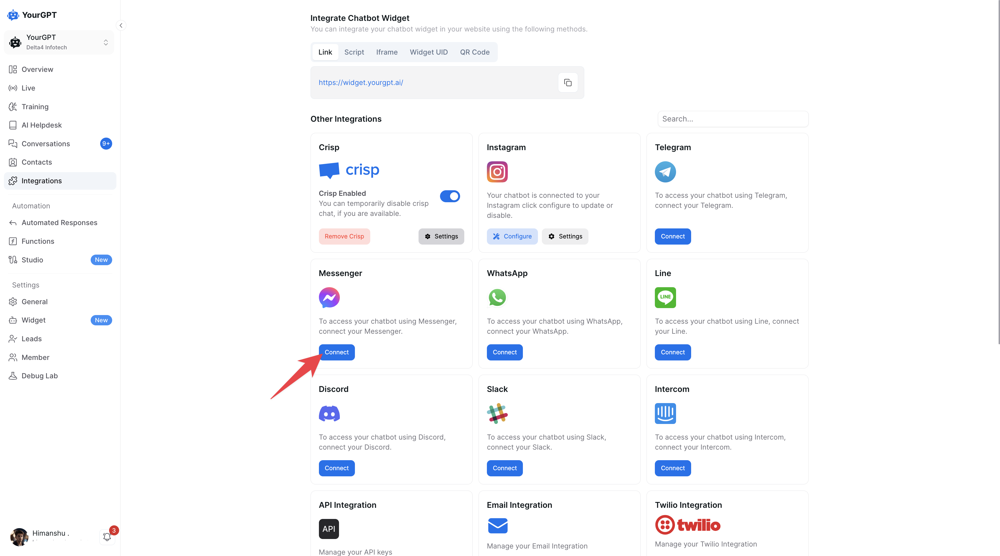

2: Under the Messenger section, Select <strong><code>Auto</code></strong> and click Connect.

4: Log in to your Facebook account and select Continue as Your Business Name.

  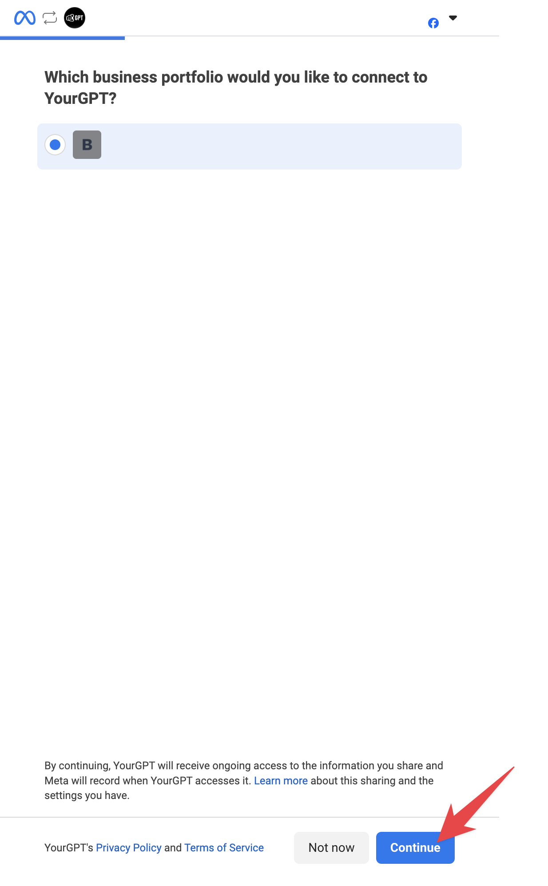

5: Select an existing Facebook Page or create a new one:

  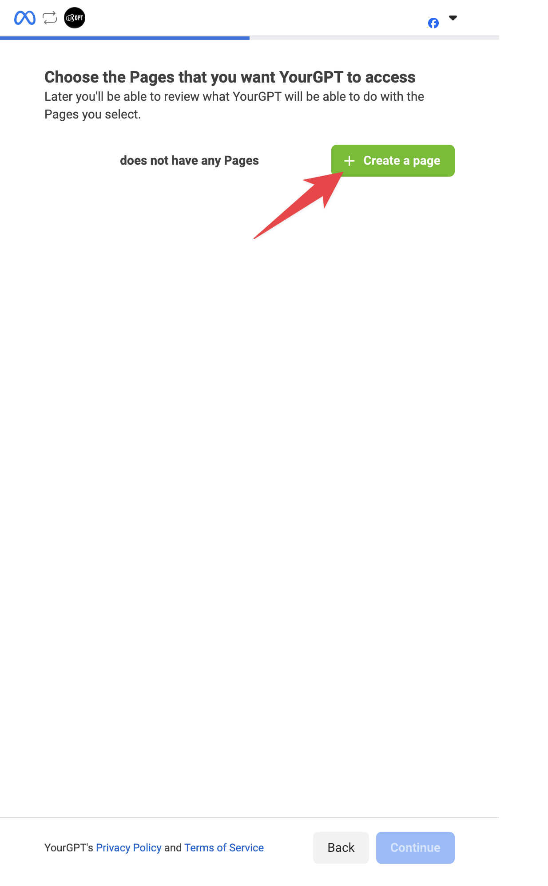

  - To create a new page, enter the Page Name and Category, then click Create.

  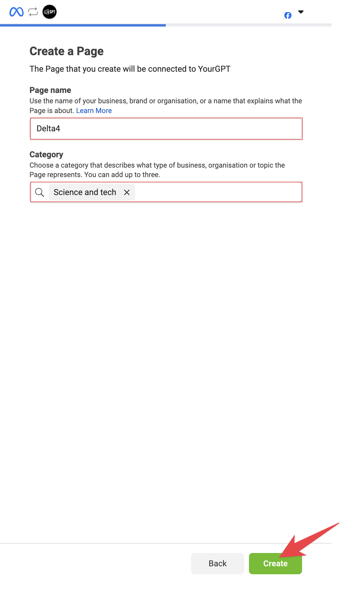

6: Confirm your selected page by checking the box and clicking Continue.

  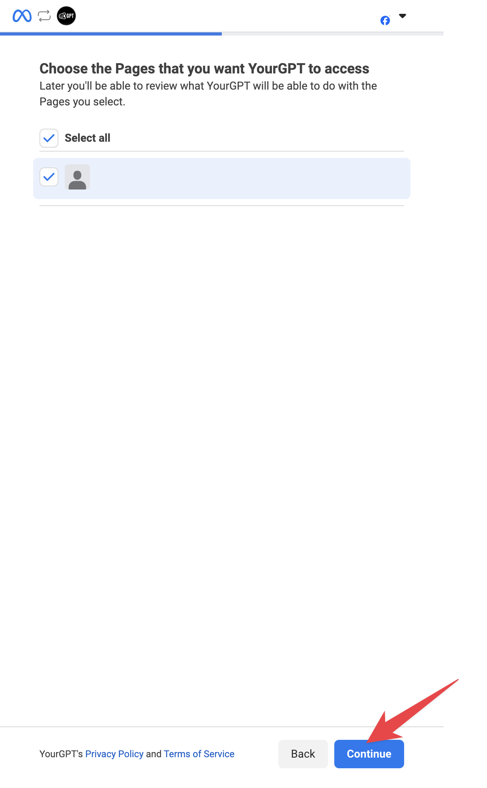

7: Allow all required permissions by clicking Next when prompted.

  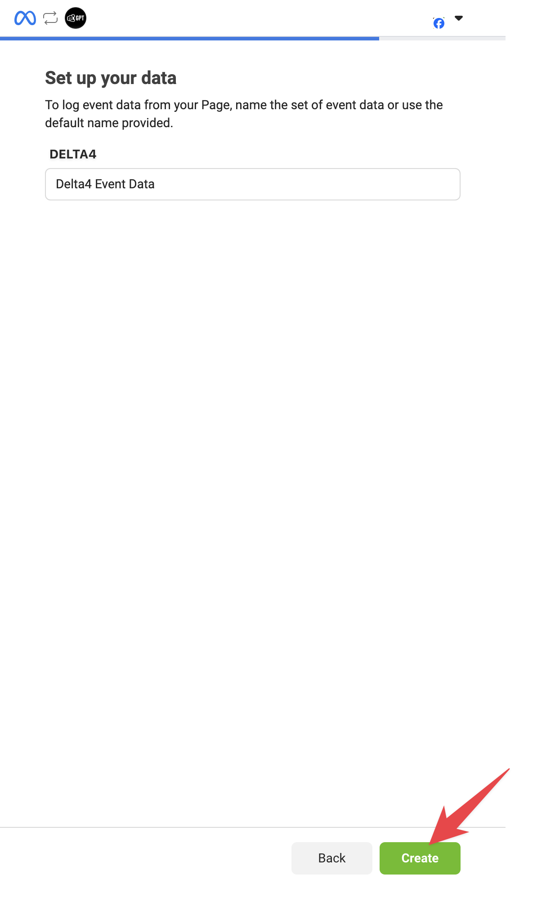

8: Confirm the page for the integration

  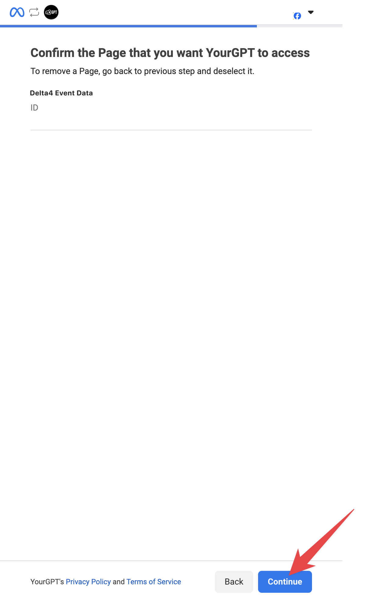

9: Follow the further steps, verify and review the integration settings.

10: Finalize the setup. Your Messenger account will now be linked to YourGPT.

---

## Custom Installation

  <iframe
    width="100%"
    style={{ height: "100%" }}
    src="https://www.youtube.com/embed/tSGg-guW8RI?si=DfOT4y6c9BiIPxXk"
    title="YouTube video player"
    frameBorder="0"
    allow="accelerometer; autoplay; clipboard-write; encrypted-media; gyroscope; picture-in-picture; web-share"
    allowFullScreen
  ></iframe>

<ol>
  <li>
    

      Create a New App
    

    

      

        Create a <strong>New App</strong> from the{" "}
        <a
          href="https://developers.facebook.com/apps"
          target="_blank"
          className="no-underline"
        >
          <strong>Meta Developer Console</strong>
        </a>
        .
      

    

    

      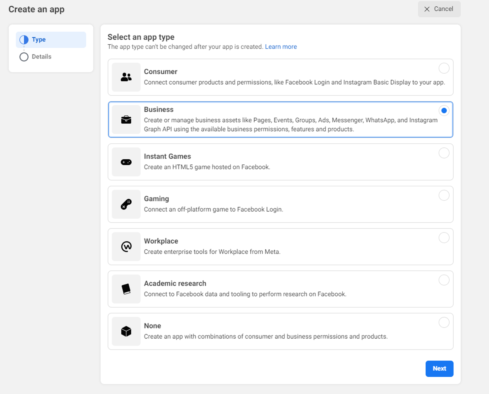
    

    

      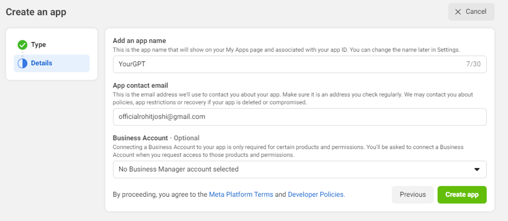
    

  </li>

  <li>
    

      Click On
    

    

      - Click on{" "}
      <strong>
        <code>Messenger</code>
      </strong>{" "}
      →{" "}
      <strong>
        <code>Setup</code>
      </strong>
    

    

      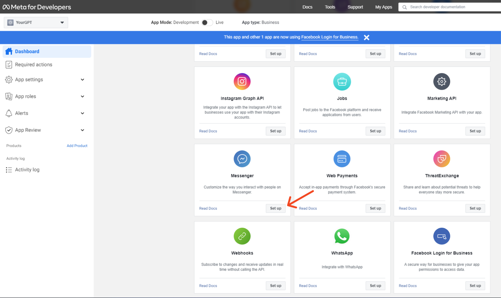
    

  </li>

  <li>
    

      Add Your Facebook Page
    

    

      - Add your{" "}
      <strong>
        <code>Facebook Page</code>
      </strong>
    

    

      
    

  </li>

  <li>
    

      Copy Page ID and Access Token
    

    

      - Copy the{" "}
      <strong>
        <code>Page ID</code>
      </strong>{" "}
      and the{" "}
      <strong>
        <code>Generated Access Token</code>
      </strong>{" "}
      for your page
    

    

      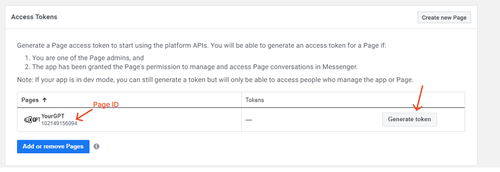
    

  </li>

  <li>
    

      Copy Client ID and Client Secret
    

    

      - Copy the{" "}
      <strong>
        <code>Client ID</code>
      </strong>{" "}
      and the{" "}
      <strong>
        <code>Client Secret</code>
      </strong>{" "}
      for your page
    

    

      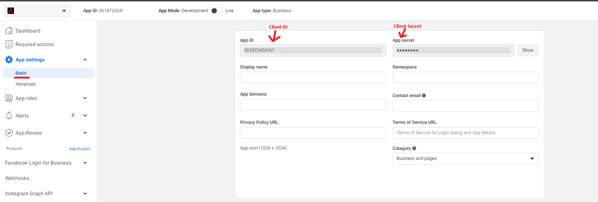
    

  </li>

  <li>
    

      Add Verify Token, Page ID, and Access Token
    

    

      - Add a random{" "}
      <strong>
        <code>Verify Token</code>
      </strong>{" "}
      (this will be used for later webhook verification), the{" "}
      <strong>
        <code>Page ID</code>
      </strong>
      , and the{" "}
      <strong>
        <code>Generated Access Token</code>
      </strong>
    

    

      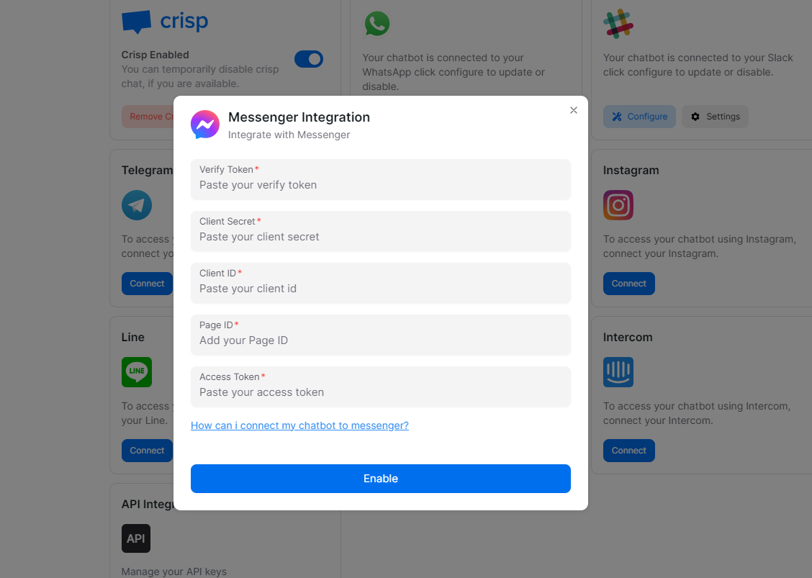
    

    

      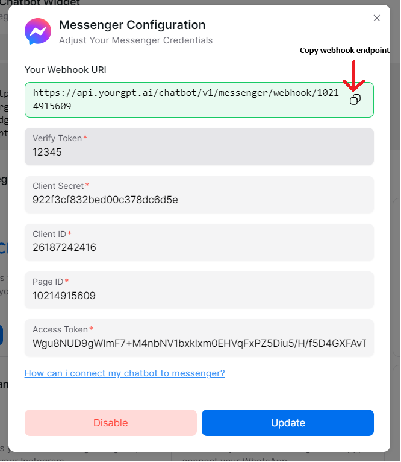
    

  </li>

  <li>
    

      Paste Webhook Endpoint
    

    

      - Paste your{" "}
      <strong>
        <code>webhook endpoint</code>
      </strong>{" "}
      and add the{" "}
      <strong>
        <code>verify token</code>
      </strong>
    

    

      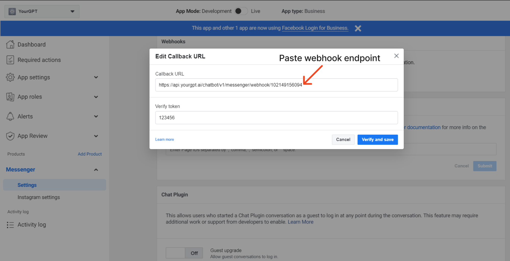
    

  </li>

  <li>
    

      Add Webhook Subscriptions
    

    

      - You can Add webhook Subscriptions (messaging, messaging_postbacks)
    

    

      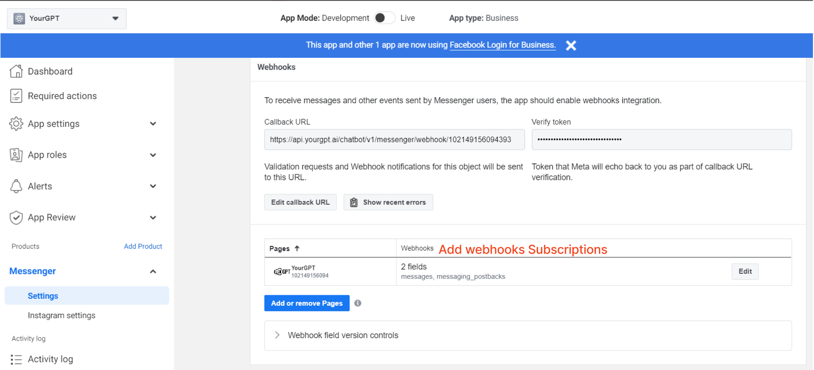
    

  </li>

  <li>
    

      Send App for Review
    

    

      - The last step is you need to send your app for review to get the
      permissions approved by Meta(formely Facebook).
    

  </li>
</ol>

## Integration Supported Types

The Integration ID for Messenger is 11 and the supported types for the integration are as follows:

<Callout title="Supported Types" type="tip">
  <ul className="list-disc pl-4 space-y-1">
    <li>Text</li>
    <li>Image</li>
    <li>Video</li>
    <li>Audio</li>
    <li>File</li>
    <li>Button</li>
    <li>Carousel</li>
    <li>Card</li>
  </ul>
  

    Note: they will be handled as a generic template.
  

  

    Note: More than 3 buttons with handle action type path will be handled as
    quick replies; otherwise, they will be handled as a generic template.
  

</Callout>

<Callout title="Not Supported" type="warning">
  <ul>
    <li>Form</li>
  </ul>
</Callout>

---

  

    By following these steps, you can integrate YourGPT AI chatbot with
    Messenger. For any questions, contact our team via Live support or{" "}
    <a href="mailto:support@yourgpt.ai" className="no-underline">
      <strong>Mail Us</strong>
    </a>
    .
  

