# Slack

> Integrate YourGPT Chatbot with Slack to automate conversations in your workspace.

{/* <Note type="idea" color="emerald">
 Connecting Your Bot with Slack
</Note>  */}
<Callout title="Connecting Your AI Chatbot with Slack" type="tip" />

<div style={{ height: '20px' }}></div>

<div
  style={{
    aspectRatio: 16 / 9,
    width: '100%',
  }}
>
  <iframe
    width="100%"
    style={{ height: '100%' }}
    src="https://www.youtube.com/embed/mui1-dpBKR4?si=DfOT4y6c9BiIPxXk"
    title="YouTube video player"
    frameBorder="0"
    allow="accelerometer; autoplay; clipboard-write; encrypted-media; gyroscope; picture-in-picture; web-share"
    allowFullScreen
  ></iframe>
</div>

##  Register with Slack
To begin integrating Slack, you will need to register on the **`Slack API site`**.

###  Create Your First App 
<div>
  <p>
    Once registered, head to <a href="https://api.slack.com/apps" target="_blank" className='no-underline'><strong>Slack Apps</strong></a> to create your first app.
  </p>
</div>

<div className="flex justify-center items-center rounded-md p-4">
  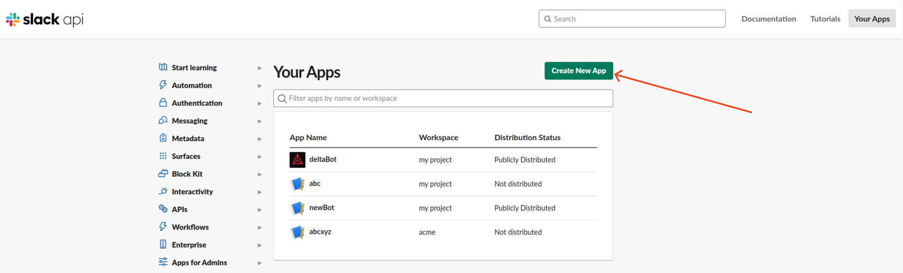
</div>

### Obtain App ID and Access Token 

To Obtain the App ID and Access Token, you need to create an app, select the option **`From Scratch`**. You will now be redirected to the next page. Here, enter your **`App Name`** and select the **`Workspace`** where you wish to develop your app. Once done, click on **`Create App`**.

After creating the app, copy the following details from the **`Basic Information`** section:
- **App ID**

<div className="flex justify-center items-center  rounded-md p-4">
  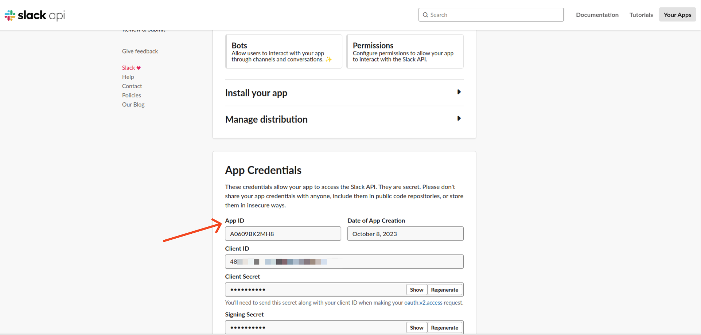
</div>

##  Configuration 

###  OAuth & Permissions 
Configure redirect URLs and choose the necessary bot scopes required to access workspace data. Enable bot commands for interaction.

- **Redirect URLs**: You need to add a valid URL from your domain as the redirect URL.

<div className="flex justify-center items-center  rounded-md p-4">
  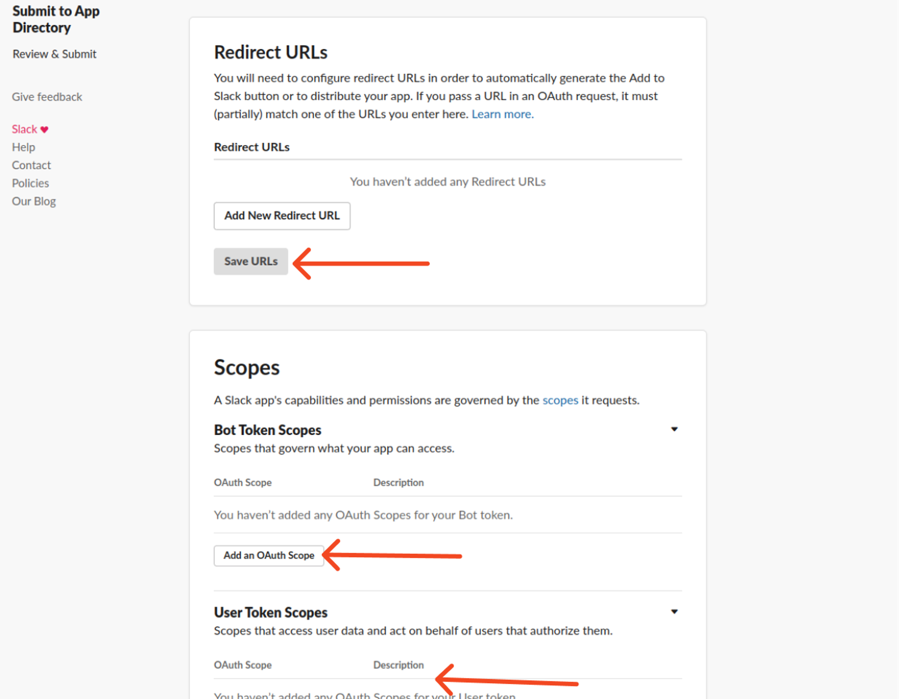
</div>

- **Bot Scope**: Choose the **```commands```** Bot Token Scope.

<div className="flex justify-center items-center  rounded-md p-4">
  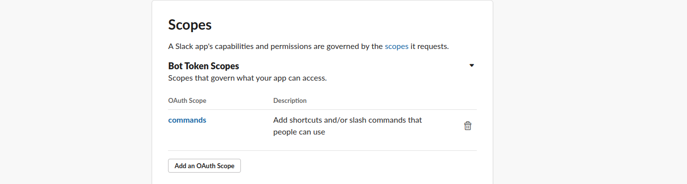
</div>

- Install the app to your workspace.

<div className="flex justify-center items-center  rounded-md p-4">
  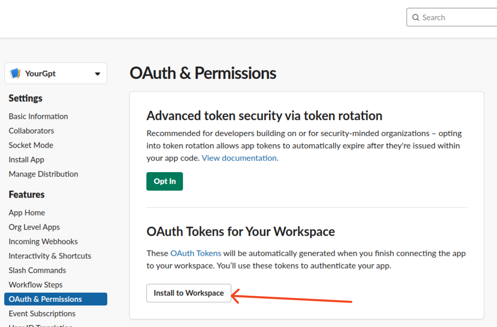
</div>

- Copy the **```Bot User OAuth Token```** and paste the token in YourGPT Slack **Access Token** field.

<div className="flex justify-center items-center rounded-md p-4">
  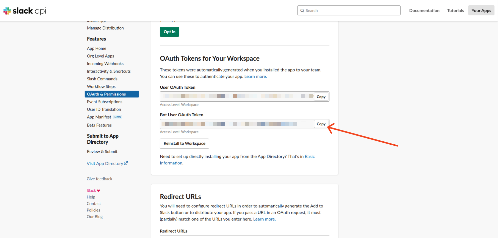
</div>

- In the **`App Home`** section, enable the option "Allow users to send messages with slash commands".
<div className="flex justify-center items-center  rounded-md p-4">
  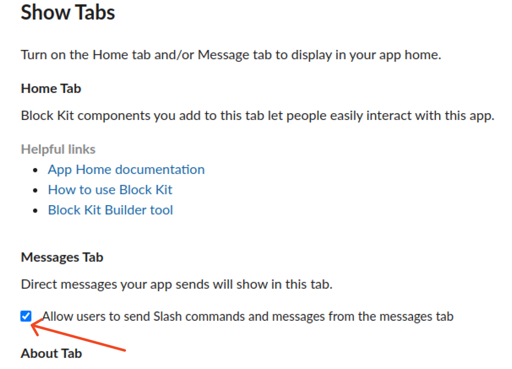
</div>

###  Enable Integration 
To enable integration, follow these steps:

1. Obtain the app ID from the Basic Information section of your Slack app.
2. Paste the copied `App ID` into the **`Application ID`** field of YourGPT Slack Integration.
3. Copy the Bot user Auth Token from the OAuth & Permissions section.
4. Paste the copied credentials into the **`Access Token`** field of YourGPT Slack Integration.

<div className="flex justify-center items-center  rounded-md p-4">
  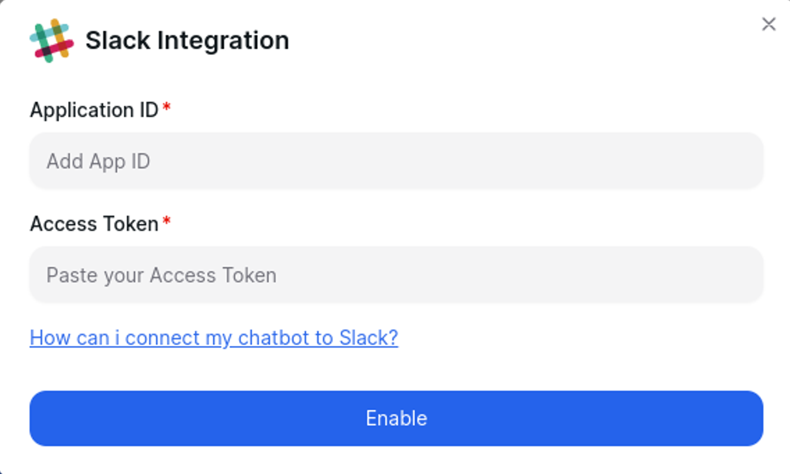
</div>

###  Copy the Webhook 
Once integrated, copy the generated webhook for further use.

<div className="flex justify-center items-center rounded-md p-4">
  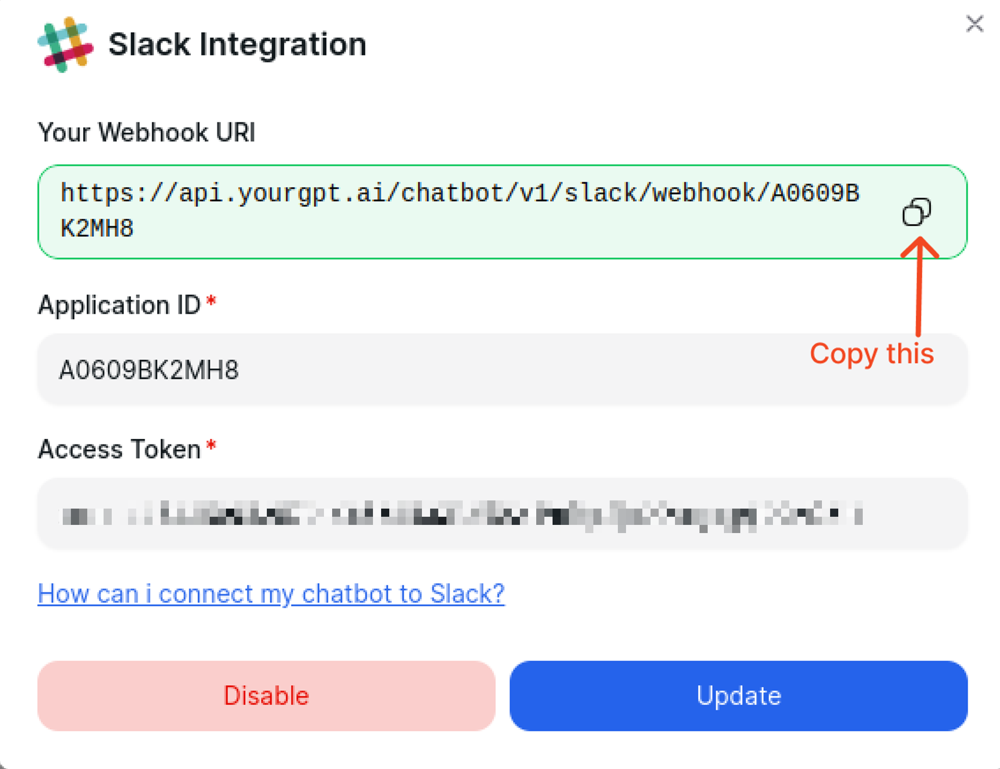
</div>

###  Create Slash Command 
Go to the **`Slash Commands`** section and create a new slash command.

<div className="flex justify-center items-center  rounded-md p-4">
  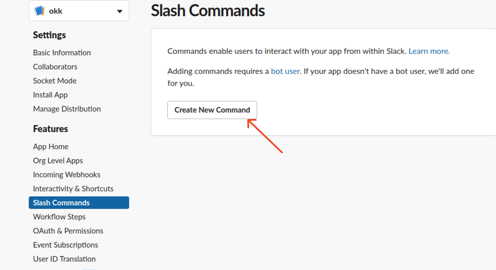
</div>

- Add the following details:
  - **Command**: The command you want to use to interact with the bot.
  - **Request URL**:  paste the webhook into the request URL.
  - **Short Description**: A description of the command.
  - **Usage Hint**: A brief description of the command.

<div className="flex justify-center items-center  rounded-md p-4">
  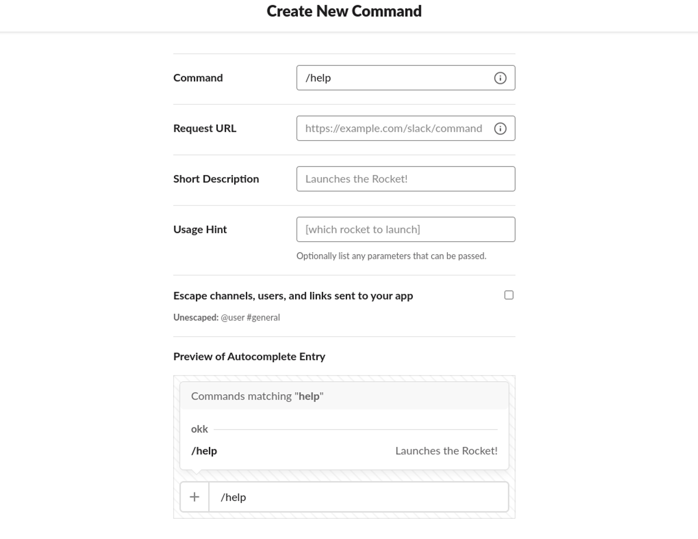
</div>

##  Additional Configuration 

- To receive notifications for desired events, add the copied webhook URL.

<div className="flex justify-center items-center rounded-md p-4">
  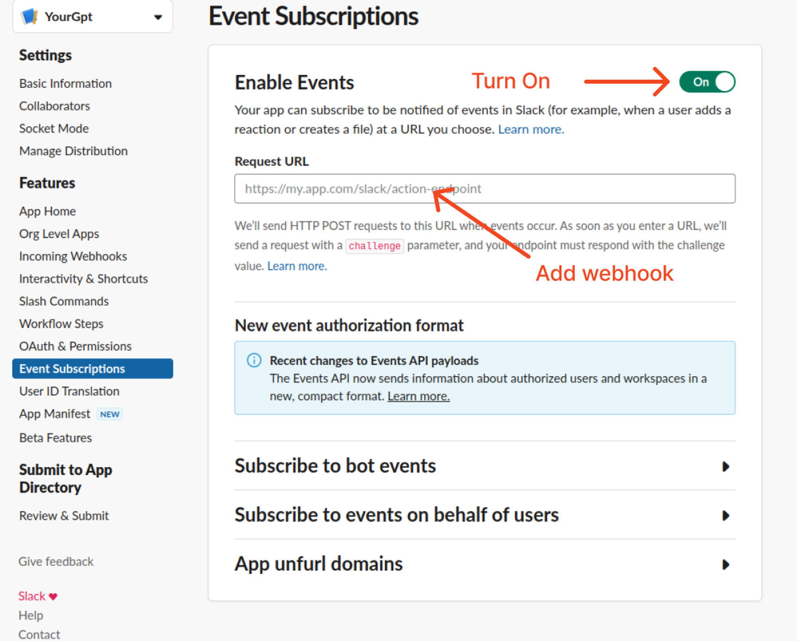
</div>

<div>
  <p>
    - Subscribe to the <a href="https://api.slack.com/events/link_shared" target="_blank" className='no-underline'><strong>link_shared</strong></a>, 
    <a href="https://api.slack.com/events/message.im" target="_blank" className='no-underline'><strong>message.im</strong></a>, and 
    <a href="https://api.slack.com/events/message.channels" target="_blank" className='no-underline'><strong>message.channels</strong></a> events.
  </p>
</div>

<div className="flex justify-center items-center  rounded-md p-4">
  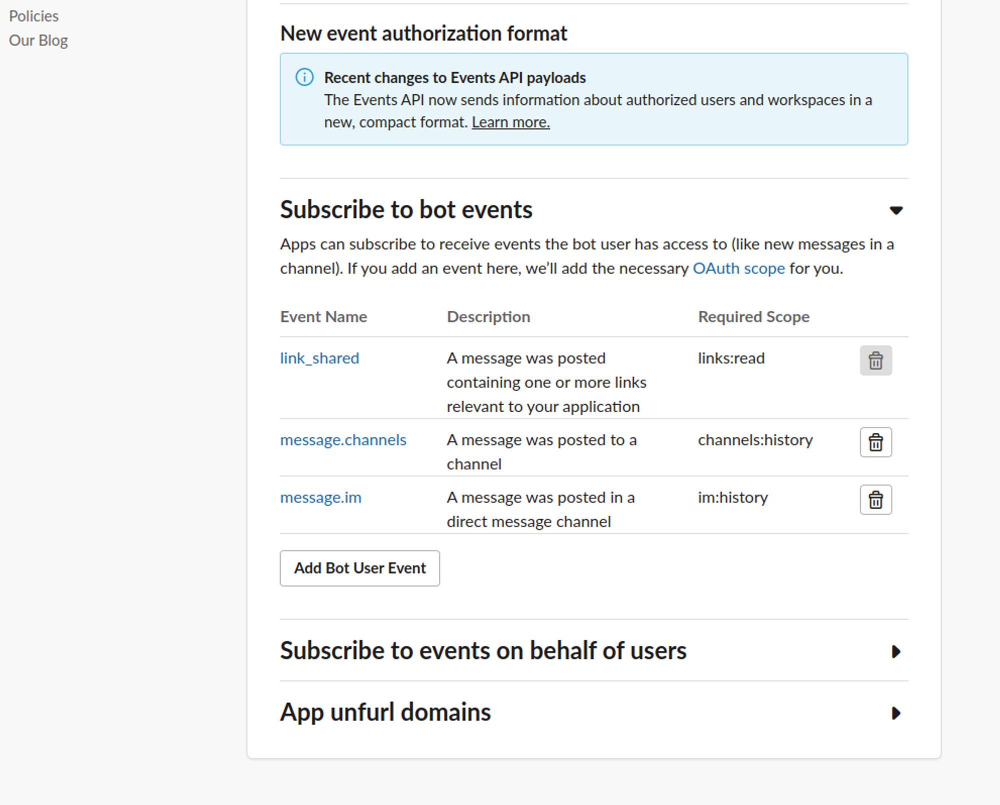
</div>

##  Flow Messaging Setup 

- Ensure webhook URL is added for flow messages to function properly.
<div className="flex justify-center items-center  rounded-md p-4">
  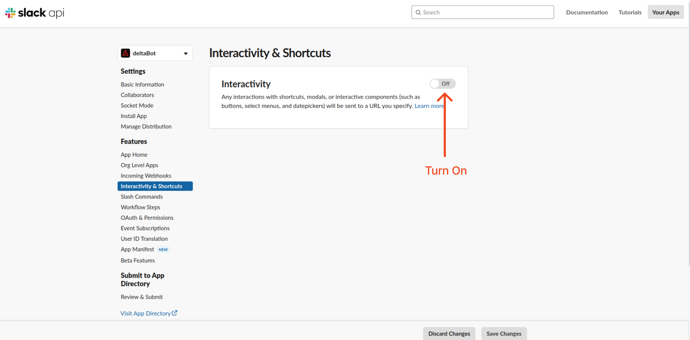
</div>

<div className="flex justify-center items-center  rounded-md p-4">
  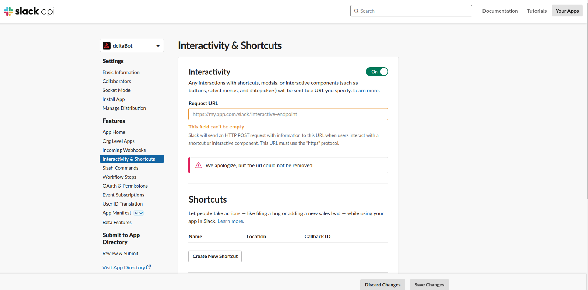
</div>

- After a successful response, it will be added; otherwise, an error will occur.

{/* <Note type="note" color="blue">
  Without using a slash command or mentioning the bot (@BOT), responses will only occur in direct messaging, not in general group chats.
</Note> */}

<Callout title="Without using a slash command or mentioning the bot (@BOT), responses will only occur in direct messaging, not in general group chats." type="tip"/>

## Integration Supported Types
The Integration ID for Slack is 16 and the supported types for the integration are as follows:
<Callout title="Supported Types" type="tip">
- Text  
- Image  
- Button  
- Carousel  
- Card  
</Callout>

<Callout title="Not Supported" type="warning">
- Video  
- Audio  
- File  
- Form  
</Callout>

<div>
  <p>
    By following these steps, you can easily integrate your chatbot with Slack. For any questions, contact our team via Live support or 
    <a href="mailto:support@yourgpt.ai" className='no-underline' target='_blank'><strong>Mail Us</strong></a>.
  </p>
</div>