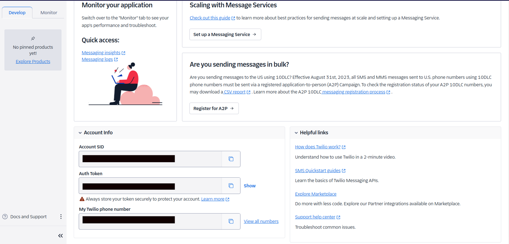
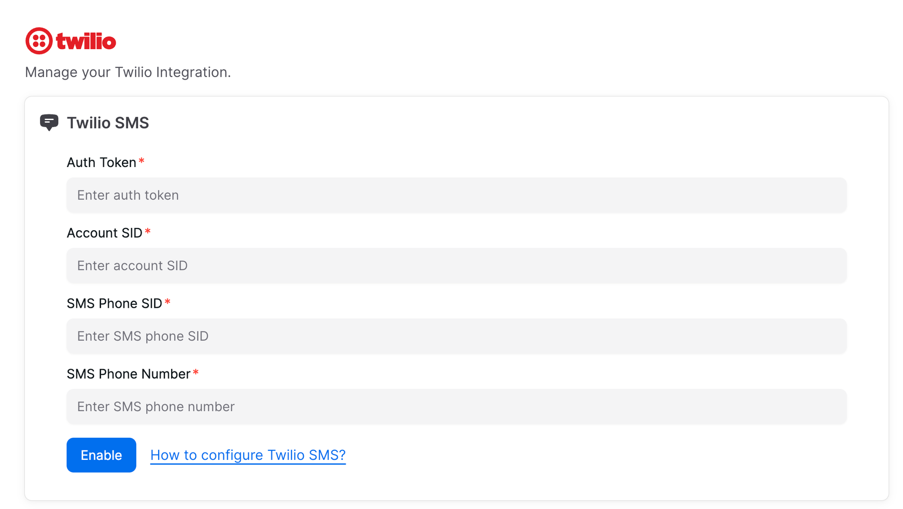
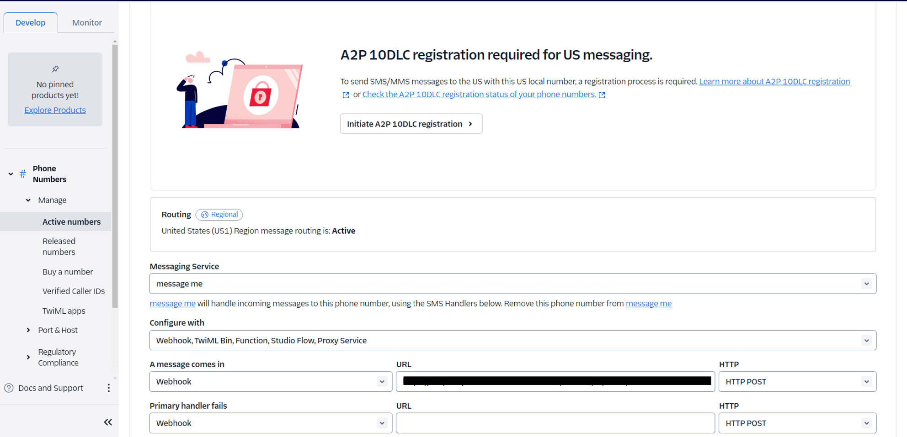

# Twilio SMS

> Learn how to integrate your AI Chatbot with Twilio SMS

<Callout title="Connecting Your AI Chatbot with Twilio SMS" type="tip" />

To set up Twilio SMS integration, follow these steps:

### Step 1: Obtain Twilio Credentials

- Log into your Twilio account.
- Go to the **Develop** tab to find your Account SID and Auth Token.

  

### Step 2: Get Phone Number SID

- Go to **View All Numbers**.
- Select your number, go to **Properties**, and copy your Phone Number SID.
- Add the following fields:
  - **Account SID**: Your Twilio account SID.
  - **Auth Token**: Your Twilio Auth Token.
  - **Phone Number SID**: The SID of your Twilio phone number.

  

### Step 3: Set Webhook Endpoint

- Obtain your webhook endpoint.
- Add this webhook to your phone number in the message configuration:
  - Go to **Develop** → **View All Numbers** → Select your number → **Configure**.

  

<Callout title="Only text message is supported" type="warning"/>