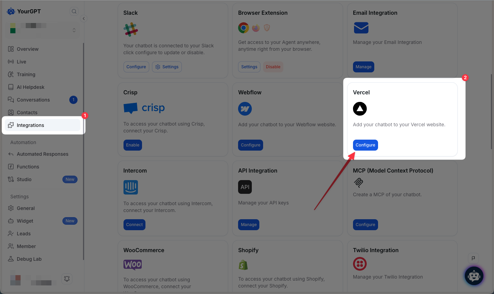
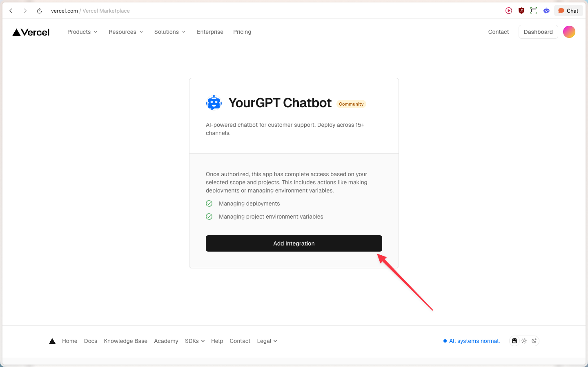
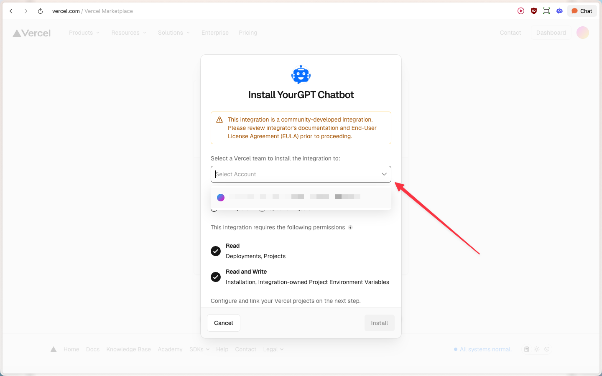
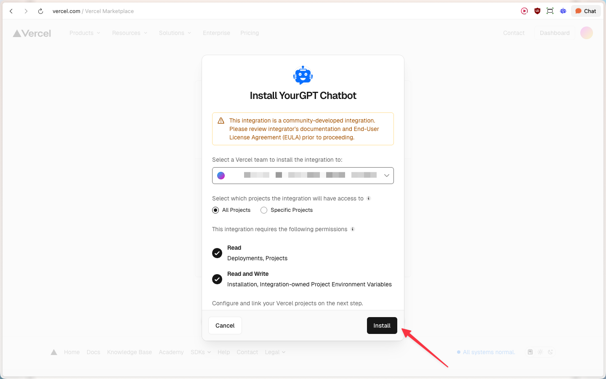
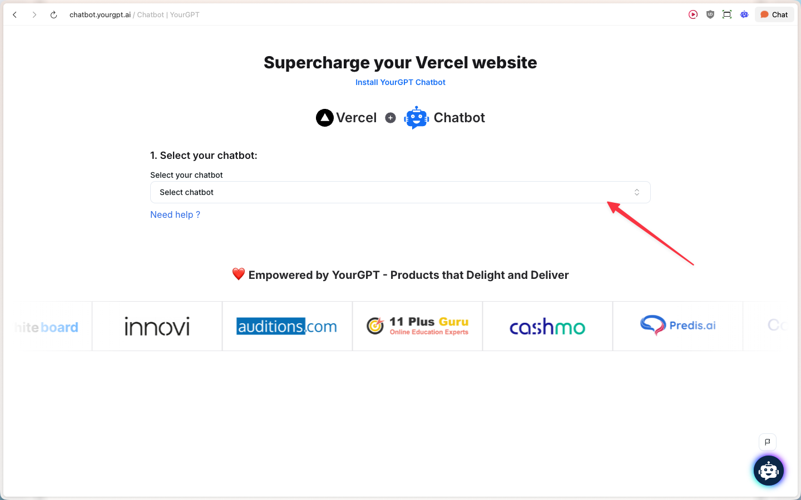
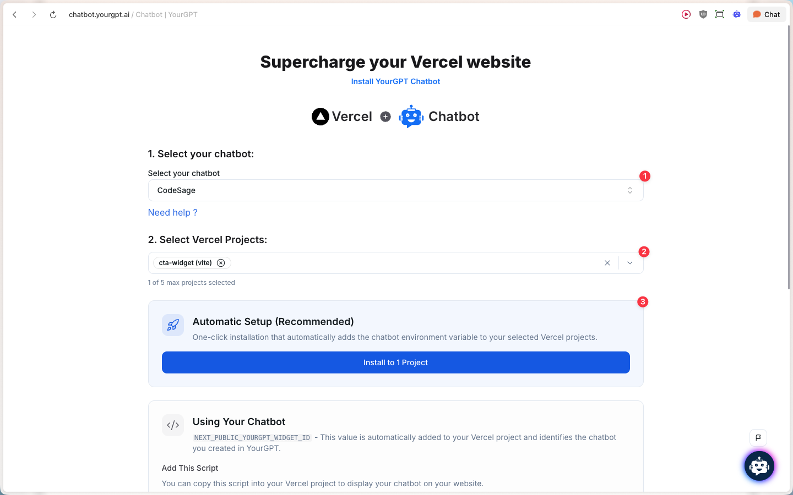
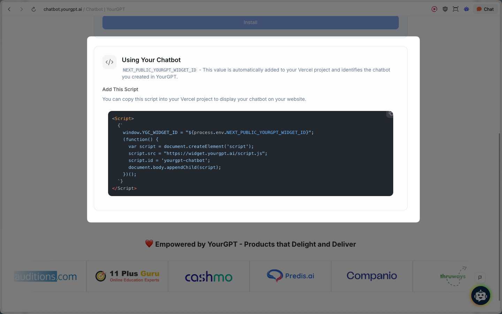

# Vercel

> Learn how to integrate YourGPT Chatbot with your Vercel website with our detailed, step-by-step guide

<Callout title="Connecting Your AI Chatbot with Vercel" type="tip" />

## Installation

Follow these steps to integrate your YourGPT chatbot with your Vercel website:

<Steps>
  <Step>
    Navigate to **Integrations** in your YourGPT dashboard and click **Configure** on the Vercel integration card.

    
  </Step>

  <Step>
    On the Vercel Marketplace page, review the integration permissions and click **Add Integration**.

    
  </Step>

  <Step>
    Select your Vercel account to install the integration.

    
  </Step>

  <Step>
    Choose which projects the integration will have access to (All Projects or Specific Projects), then click **Install**.

    
  </Step>

  <Step>
    You'll be redirected to the YourGPT configuration page. Select your chatbot from the dropdown menu.

    
  </Step>

  <Step>
    Select the Vercel project(s) you want to integrate with, then click **Install to 1 Project** (or more if you selected multiple). The integration will automatically add the chatbot environment variable to your selected Vercel projects.

    
  </Step>
</Steps>

## Manual Setup

### Step 1: Environment Variable

Once connected, the following environment variable is automatically added to your Vercel project:

| Variable | Description |
|----------|-------------|
| `NEXT_PUBLIC_YOURGPT_WIDGET_ID` | Your selected YourGPT chatbot widget UID |

### Step 2: Embed the Widget

You can copy this script into your Vercel project to display your chatbot on your website.


```javascript
<script>
    window.YGC_WIDGET_ID = "${process.env.NEXT_PUBLIC_YOURGPT_WIDGET_ID}";
    (function() {
      var script = document.createElement('script');
      script.src = "https://widget.yourgpt.ai/script.js";
      script.id = 'yourgpt-chatbot';
      document.body.appendChild(script);
    })();
</script>
```