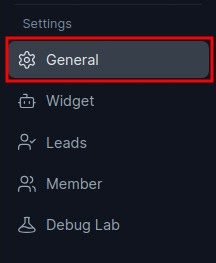

# Connected Chatbots

> Link multiple chatbots for shared knowledge while customizing settings and behavior.

Connected Chatbots feature allows you to link multiple chatbots together, creating a parent-child relationship. This can be particularly useful in a variety of scenarios, including:

## Use Cases

### Staging & Production Environments

You can set up a staging chatbot that is connected to the production chatbot’s knowledgebase.  
This way, you can test features and updates on the staging chatbot without affecting the production chatbot. Once you are satisfied with the changes, you can push them to production while keeping both bots in sync on content.

### Custom Settings & Behavior

You can create multiple chatbots with the same knowledgebase but with different settings and behavior. For example, you can create a chatbot for sales and another chatbot for support. Both chatbots will have the same knowledgebase but different settings and behavior. Similarly, you can create chatbots for different integration with different base prompt and same knowledgebase.

Both use the same knowledgebase but have different prompts, tone, and rules.

You can also create chatbots for different integrations (e.g. website, WhatsApp, Intercom) with different base prompts and the same shared knowledgebase.

### Any Parent–Child Use Case

You can create a child chatbot that is connected to multiple parent chatbots. Your child chatbot will aquire the knowledge of the parent chatbots. This can be useful for any parent child based usecase.

## How to Enable Connected Chatbots

To enable the Connected Chatbots feature, follow these steps:

1. Go to the **General settings** of your chatbot.

2. Click on the **Connect Chatbots** option.

By connecting chatbots this way, you can combine the strengths of multiple bots, reuse knowledge across environments, and still keep behavior and settings tailored to each specific use case.