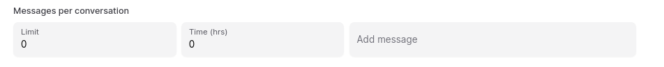
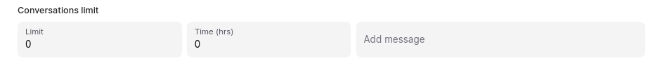

# Security Settings for YourGPT Chatbot

> Guide to YourGPT Chatbot security controls.

Manage your chatbot's security settings to ensure safe and controlled interactions. It is important to protect your chatbot from spam, misuse, and unauthorized access. YourGPT Chatbot provides a range of security features to help you manage and control the interactions with your chatbot.

## Throttling Settings

Throttling settings help you control the rate of user interactions with your chatbot.

### Messages per Conversation

- **Limit**: Set a limit on the number of messages that can be sent in a single conversation.  
- **Time (hrs)**: Define the time frame (in hours) for this limit.  
- **Add Message**: Add a custom message that will be displayed when the limit is exceeded.

### Conversations Limit

- **Limit**: Set a limit on the number of conversations a user can initiate.  
- **Time (hrs)**: Define the time frame (in hours) for this limit.  
- **Add Message**: Add a custom message that will be displayed when the limit is exceeded.

## Access Control List

The Access Control List (ACL) allows you to control who can interact with your chatbot.

- **Whitelist**: Specify the IP addresses or countries that are allowed to interact with your chatbot.  
- **AllowBlock**: Choose whether to allow or block access based on the specified criteria.  
- **IP**: Enter the IP addresses that you want to allow or block.  
- **IPCountry**: Enter the countries that you want to allow or block.

By managing these security settings, you can ensure that your chatbot is protected from spam and misuse, and that it interacts only with authorized users.