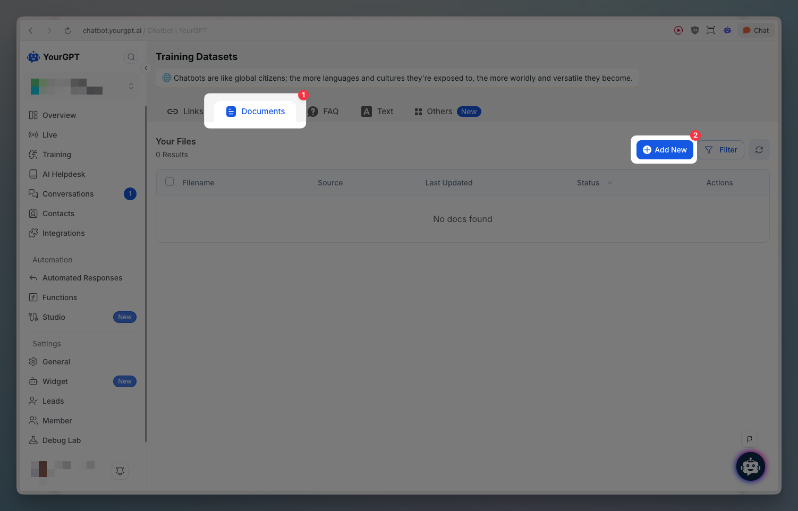
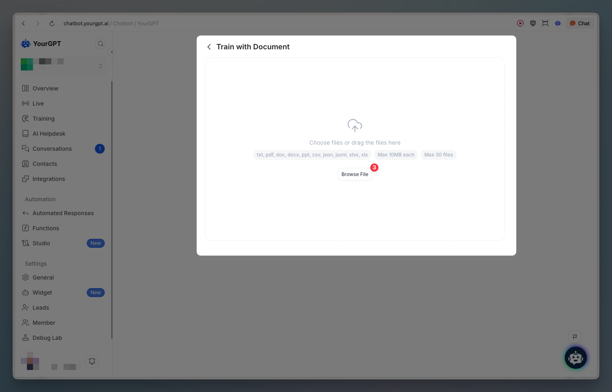
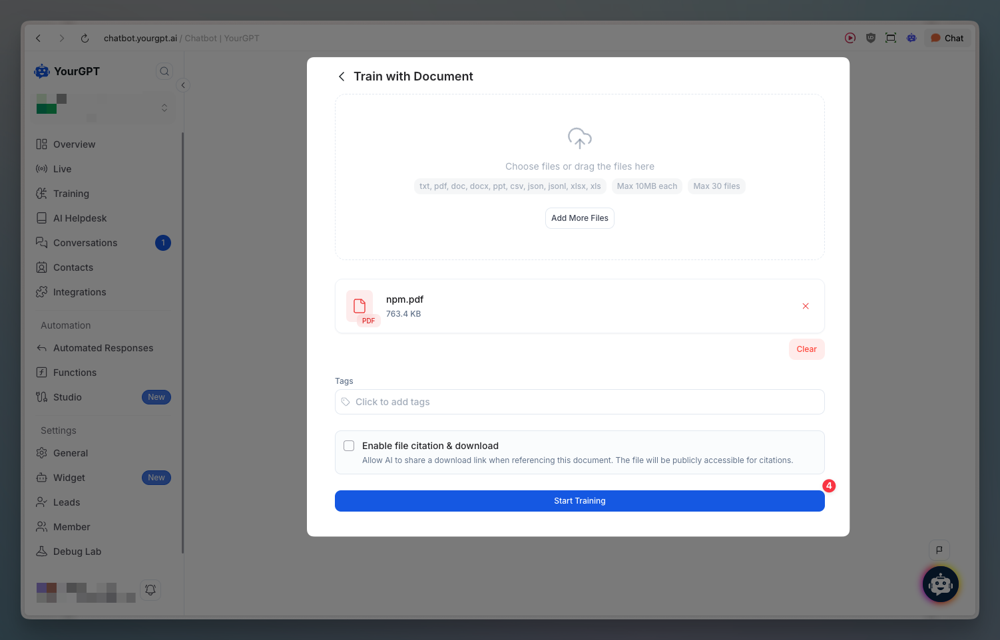
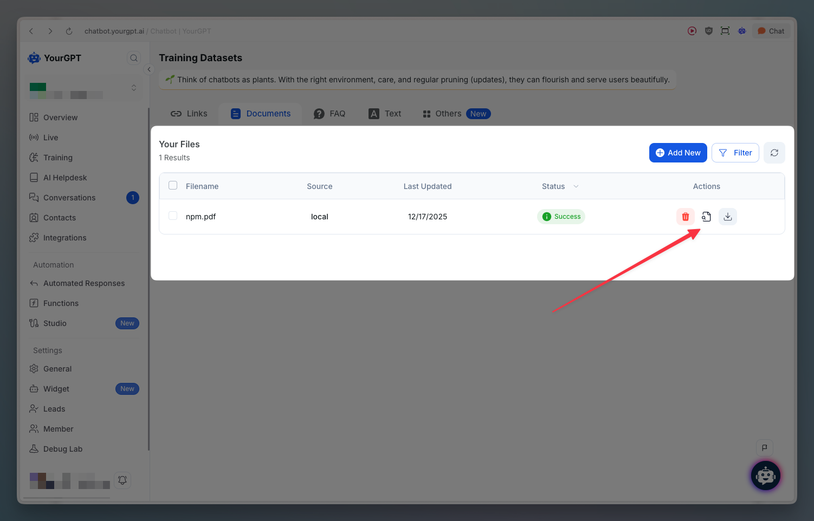
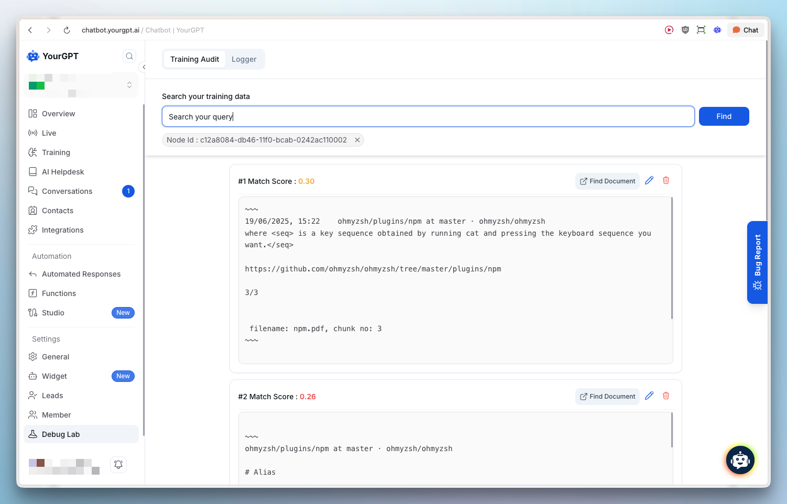
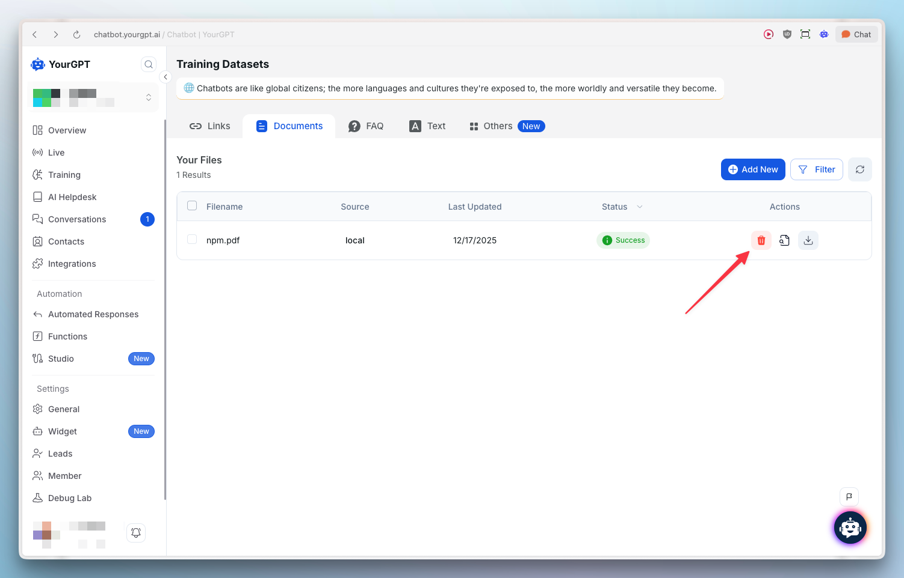
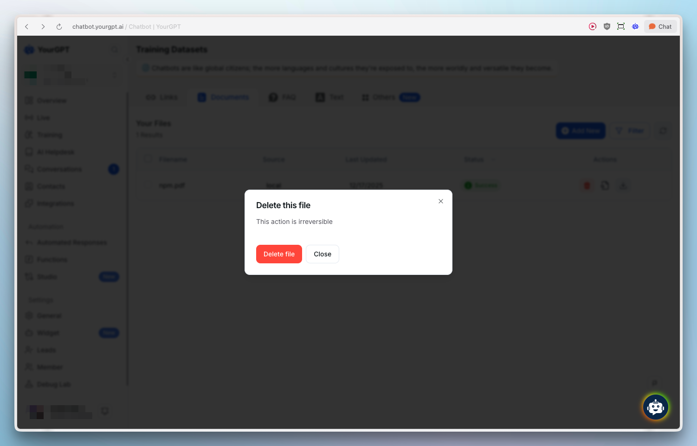

# Documents

> Train your AI chatbot using document files like DOC, CSV, PDF, PPT and more

## Quick Start

Train your bot easily by adding documents like DOC, CSV, PDF, PPT and more.

<Steps>
  <Step>
    Go to the **Training** section in YourGPT Dashboard
  </Step>
  <Step>
    Click **Add New**
    
  </Step>
  <Step>
    A window will pop up to add your documents
    
  </Step>
  <Step>
    Add your document and start training
    
    
  </Step>
</Steps>

## Check Training Source

To see how your chatbot is being trained from a document, follow these steps:

<Steps>
  <Step>
    Click on the document search icon
    
  </Step>
  <Step>
    You will be redirected to debug lab where you can see the document source
    
  </Step>
</Steps>

<Callout type="info" title="Learn More">
  For more information on searching, making changes, and removing chunks from trained documents, check out the [Training View Source documentation](/chatbot/debugging/conversation-logs/training-audit#view-training-source).
</Callout>

## Delete Document

To remove a document from your training data:

<Steps>
  <Step>
    Click on the remove document icon
    
  </Step>
  <Step>
    Confirm the deletion
    
  </Step>
</Steps>

<Callout title="Learn More" type="info">
  For detailed step-by-step instructions, visit our help article on [How to Train Chatbot using Documents Files](https://help.yourgpt.ai/article/how-to-train-chatbot-using-documents-files-56).
</Callout>