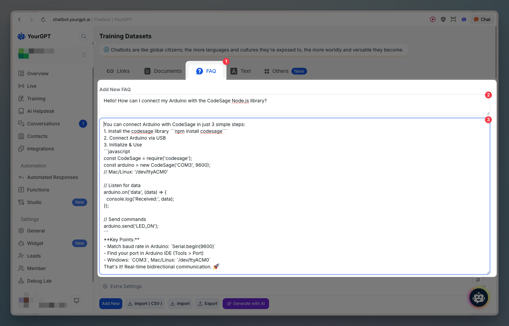
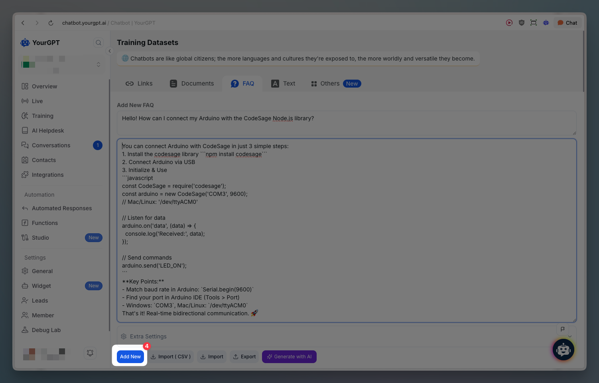
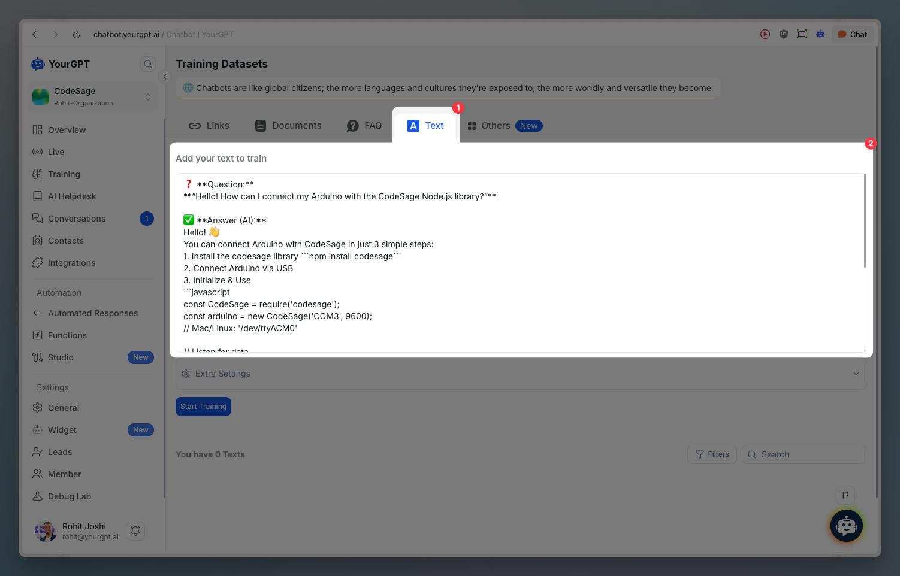
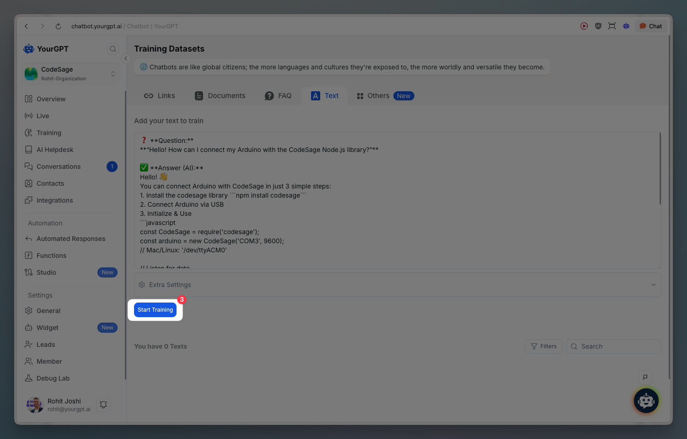

# FAQs & Text

> Train your AI chatbot with FAQs - Add, Import, or Export FAQ files. FAQs help users quickly find solutions and understand key information.

## Quick Start

To train chatbot with FAQ manually, follow these steps:

<Steps>
  <Step>
    Go to **Training**, then click on **FAQ**
  </Step>
  <Step>
    Add a Question and Answer to your FAQ or you can generate it using AI
    
  </Step>
  <Step>
    Click on **Add New**
    
  </Step>
</Steps>

## Bulk Import FAQs

To train chatbot with multiple FAQs, follow these steps:

<Steps>
  <Step>
    Go to the **FAQ** in the training section
  </Step>
  <Step>
    Click on **Import**
  </Step>
  <Step>
    Add your JSON file, which consists of all your FAQs
  </Step>
</Steps>

## Export FAQs

To export your FAQs, follow these steps:

<Steps>
  <Step>
    Go to **Training**, then click on **FAQs**
  </Step>
  <Step>
    Click on **Export** button
  </Step>
</Steps>

## Training on Text

You can train your chatbot with raw text content. This allows you to add any text-based information directly to your training dataset.

<Steps>
  <Step>
    Go to **Training**, then click on **Text** tab
  </Step>
  <Step>
    Enter your text in the text input area (or paste content)
    
  </Step>
  <Step>
    (Optional) Configure **Extra Settings** if needed
  </Step>
  <Step>
    Click **Start Training** button
    
  </Step>
</Steps>

<Callout title="Learn More" type="info">
  For detailed step-by-step instructions, visit our help article on [How to Training Chatbot with FAQs](https://help.yourgpt.ai/article/how-to-training-chatbot-with-faqs-59).
</Callout>