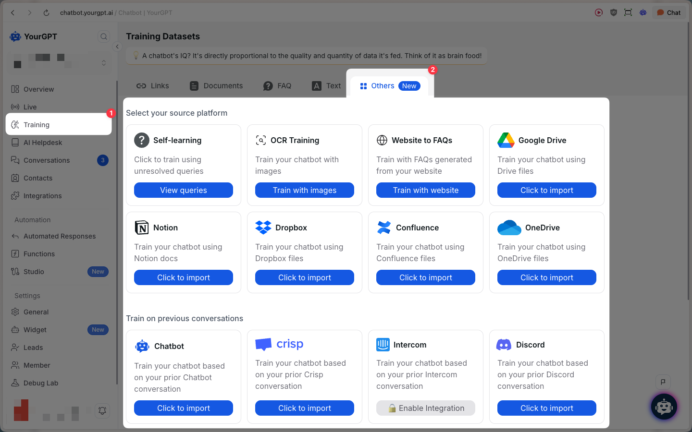

# Others

> Train your chatbot using OCR, self-learning, Drive imports, and more

## Quick Start

The **Others** tab groups additional training sources beyond Links, Documents, and FAQs—like OCR (images), self-learning from unresolved queries, website-to-FAQ generation, and imports from popular knowledge tools.

<Steps>
  <Step>
    Go to the **Training** section in your YourGPT dashboard.
  </Step>
  <Step>
    Click **Add New**, then open the **Others** tab.
    
  </Step>
</Steps>

## Available Sources

  <Card
    title="Self-learning"
    href="https://help.yourgpt.ai/article/how-to-train-chatbots-using-unresolved-queries-61"
  >
    Train using unresolved user queries (review queries before training).
  </Card>

  <Card title="OCR Training">
    Train your chatbot using <strong>images</strong> (extracts text via OCR).
  </Card>

  <Card title="Website to FAQs">
    Generate FAQs from your website and use them for training.
  </Card>

  <Card
    title="Google Drive"
    href="https://help.yourgpt.ai/article/how-to-training-chatbot-with-google-docs-63"
  >
    Import files directly from your cloud storage.
  </Card>

  <Card
    title="OneDrive"
    href="https://help.yourgpt.ai/article/how-to-train-ai-from-onedrive-files-2413"
    >
    Import files directly from your cloud storage.
  </Card>

  <Card
    title="Dropbox"
    href="https://help.yourgpt.ai/article/how-to-train-chatbot-with-dropbox-documents-64"
  >
    Import files directly from your cloud storage.
  </Card>

  <Card
    title="Notion"
    href="https://help.yourgpt.ai/article/how-train-chatbot-with-notion-documents-60"
  >
    Import docs from your Notion workspace.
  </Card>

  <Card
    title="Confluence"
    href="https://help.yourgpt.ai/article/how-to-import-confluence-docs-into-yourgpt-1919"
  >
    Import pages and spaces from your Confluence workspace.
  </Card>

## Train on Previous Conversations

You can also train using historical conversations from connected channels:

  <Card title="Chatbot">
    Train from prior chatbot conversations.
  </Card>

  <Card title="Crisp">
    Train your chatbot based on your prior Crisp conversation.
  </Card>

  <Card title="Intercom">
    Train your chatbot based on your prior Intercom conversation.
  </Card>

  <Card title="Discord">
    Train your chatbot based on your prior Discord conversation.
  </Card>

  <Card title="Slack">
    Train your chatbot based on your prior Slack conversation (may require enabling the integration).
  </Card>

  <Card
    title="Zendesk"
    href="https://help.yourgpt.ai/article/import-and-train-ai-model-with-zendesk-data-3855"
  >
    Train your chatbot based on your prior Zendesk tickets.
  </Card>

  <Card
    title="Freshdesk"
    href="https://help.yourgpt.ai/article/train-ai-agent-with-freshdesk-support-data-3857"
  >
    Train your chatbot based on your prior Freshdesk tickets.
  </Card>

  <Card
    title="Zoho"
    href="https://help.yourgpt.ai/article/train-your-ai-agent-with-zoho-desk-data-3856"
  >
    Train your chatbot based on your prior Zoho tickets.
  </Card>

  <Card
    title="Gmail"
    href="https://help.yourgpt.ai/article/train-your-ai-agent-with-gmail-data-3914"
  >
    Train your chatbot based on your Gmail emails.
  </Card>

  <Card title="Outlook">
    Train your chatbot based on your Outlook emails.
  </Card>

