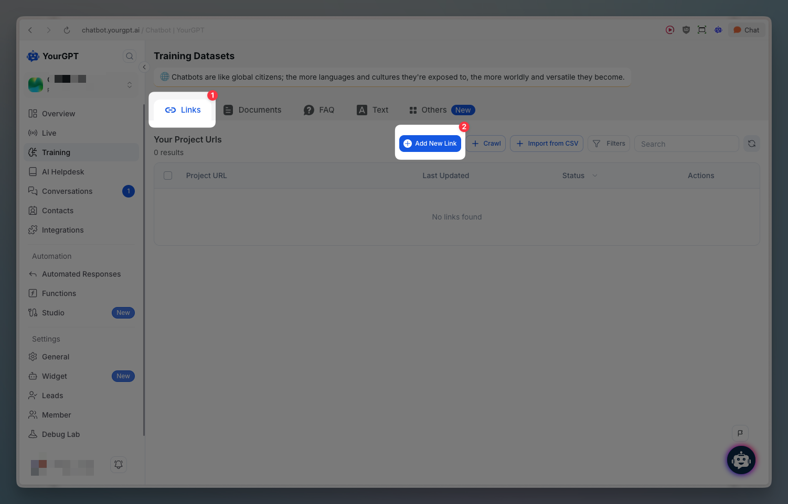
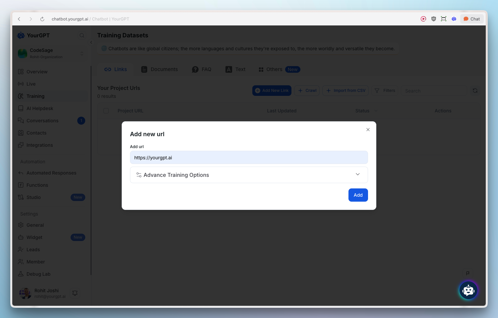
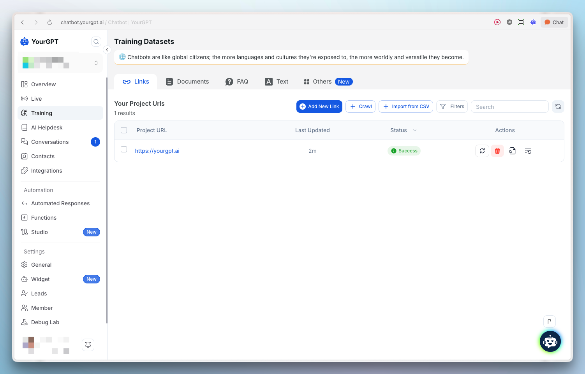
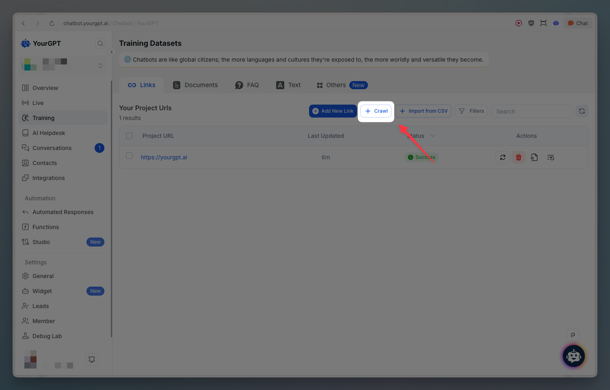
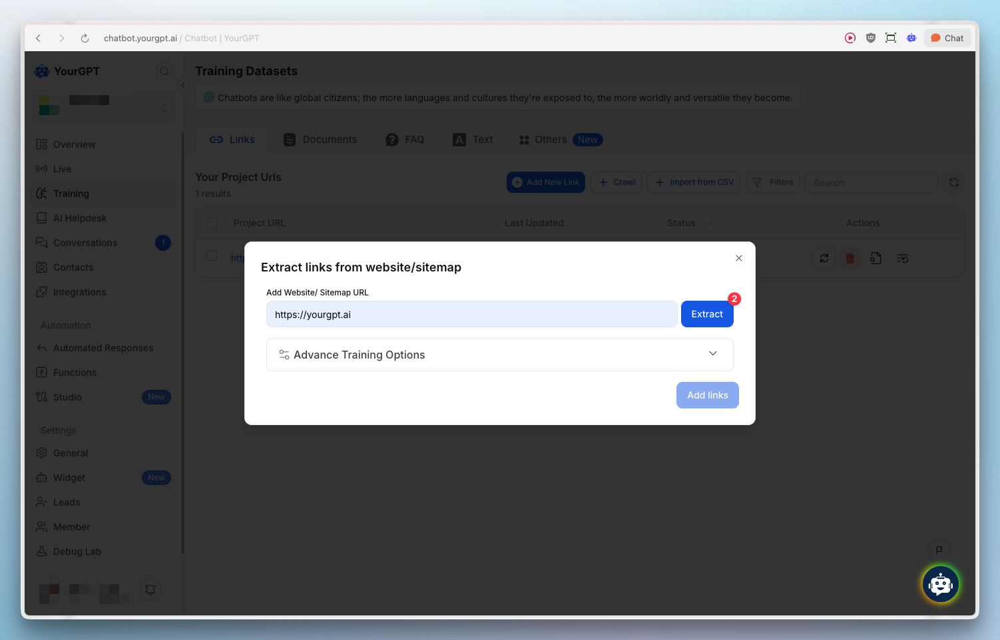
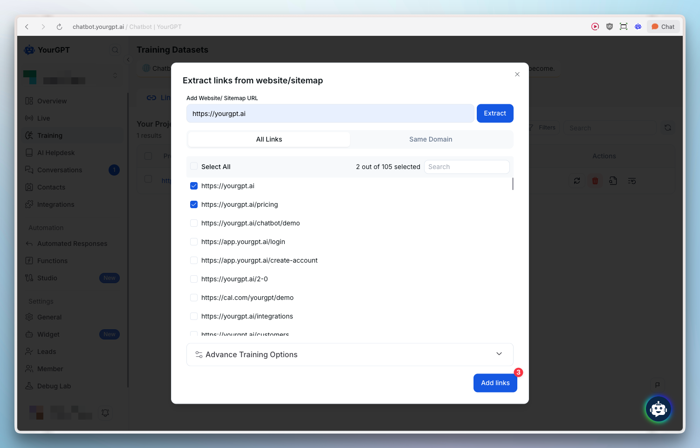
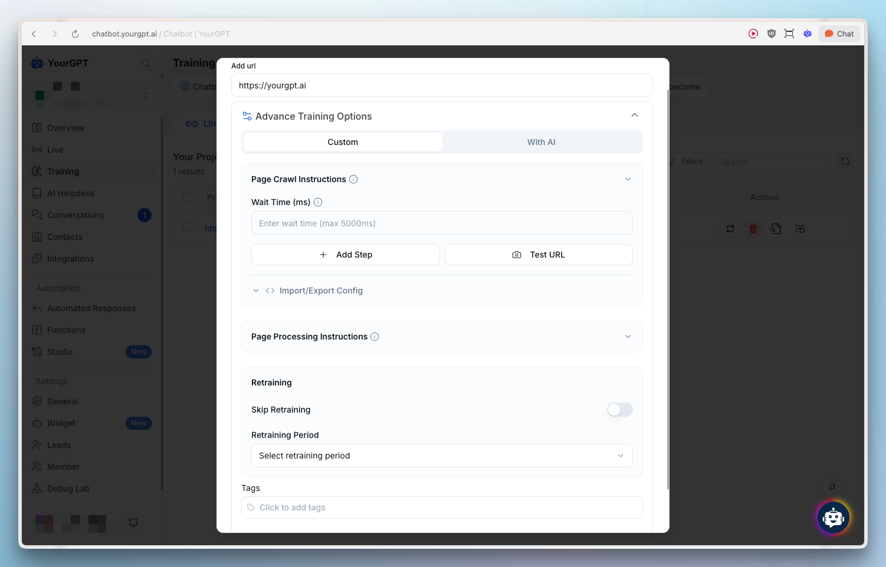

# Website & Links

> Train your AI chatbot using website links to improve its responses and knowledge about your product.

## Quick Start

<Steps>
  <Step>
    Copy your website link
  </Step>
  <Step>
    Go to the **Training** section in YourGPT Dashboard
  </Step>
  <Step>
    Click **Add New Link**
    
  </Step>
  <Step>
    Paste the link and click **Add**
    
  </Step>
  <Step>
    Wait a few minutes, then refresh the page to verify the status shows success
    
  </Step>
</Steps>

## Multiple Links

To add multiple training links at once:

<Steps>
  <Step>
    Go to **Training** → **Crawl**
    
  </Step>
  <Step>
    Paste your link in the designated field
    
  </Step>
  <Step>
    Click **Extract** to initiate the process
    
  </Step>
</Steps>

## Advanced Link Training

Advanced Training provides enhanced control over how your website content is crawled and processed. The modal offers two training modes: **Custom** and **With AI**.

### Page Crawl Instructions

Configure how the chatbot crawls your website:

- **Wait Time (ms)**: Set a delay for page loading (maximum 5000ms) to ensure dynamic content is fully loaded before crawling
- **Add Step**: Add custom crawl steps to control the crawling process
- **Test URL**: Test your URL configuration before training
- **Import/Export Config**: Manage crawl configurations for reuse

### Page Processing Instructions

Control how extracted content is processed:

- **Skip Retraining**: Toggle to skip automatic retraining of the content
- **Retraining Period**: Select how often the content should be retrained automatically
- **Tags**: Add tags to categorize and organize your training data

<Callout title="Learn More" type="info">
  For detailed step-by-step instructions and advanced training options, visit our help article on [How to Train Bot with the links](https://help.yourgpt.ai/article/how-to-train-bot-with-the-links-48).
</Callout>