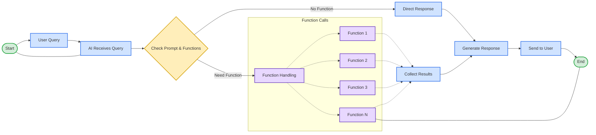

Functions act as tools or micro-agents that perform specific tasks. They are autonomous and can be guided using your base prompt.



#### Benefits

- **Chained Execution**: AI can execute a chain of functions to answer complex queries. For example, for the query "weather of India & current time," the AI would first call a function to get the weather in India and then another function to get the current time in India.
  
- **Easy Setup**: Functions are simple to set up. You only need to enable the function and, if needed, guide when the function should execute by defining it in your base prompt settings. For example, "Use Websearch function to answer any stock price-related questions and do not use web search for any other purpose."

#### Cons

- **Sequence Limitations**: Long sequences that require input across multiple messages may not work effectively.
  
- **Customization Constraints**: There are limitations on how much you can customize the functions.


#### System Functions

1. **Web Search**: This function performs web searches to fetch real-time information from the web, such as the latest news, weather updates, or stock prices.

2. **Change Language**: This function changes the language of the session, and maintains the context of the conversation in the new language.

3. **Unable To Answer Hook**: This function triggers when the AI cannot provide an answer, helping to handle cases where more information is needed or suggesting alternative actions.

4. **Get Current Datetime**: This function provides the current date and time, useful for answering questions based on time.


#### API Functions
In addition to the pre-configured system functions, you can also create custom API functions to extend the functionality of your AI. API functions allow you to call external APIs and integrate their data or services into your AI responses.
<video src="https://chatbot.yourgpt.ai/videos/Final.mp4" width="100%" height="auto"  controls autoplay loop muted>
<source src="movie.mp4" type="video/mp4" />
</video>
Step-by-step guide on how to add an API function:
1. **Name:** Enter a descriptive name for your API function.

2. **Description:** Provide a brief description of what the function does.

3. **API Endpoint:** Specify the HTTP method (e.g., GET, POST) and the endpoint URL for the API you want to call.

4. **Headers:** Add any necessary headers required by the API. Click the green plus button to add more headers if needed.

5. **Parameters (JSON):** Define the JSON schema for the parameters your API function requires. This typically includes specifying the type and properties of the parameters. For example:

6. **Add API Function:** Once all the necessary details are filled in, click the "Add API Function" button to save and enable the function.

#### Example

If you want to add a function that retrieves weather information based on geographic coordinates, you might set it up as follows:

- **Name**: Get Weather
- **Description**: Retrieves the current weather information based on longitude and latitude.
- **API Endpoint**: `GET` `https://api.weather.com/v3/wx/conditions/current`
- **Headers**: `Authorization: Bearer YOUR_API_KEY`
- **Parameters (JSON)**:
  ```json
  {
    "type": "object",
    "properties": {
      "longitude": {
        "type": "string"
      },
      "latitude": {
        "type": "string"
      }
    },
    "required": ["longitude", "latitude"]
  }
  ```
